# Trading Engine Overview

The trading engine is the main service in the Axiomara Docker Compose stack. It is a Python application that receives commands over Redis pub/sub, executes them, and persists results to PostgreSQL and MinIO. It does not expose any HTTP API — it is driven entirely by messages published by the backend. The engine is built around three core modules: **components**, **strategy**, and **trading**. The strategy module defines the interface and lifecycle for trading strategies and is documented in the [Strategy Overview](../strategy/overview). The trading module provides portfolio management, order execution, risk enforcement, and rebalancing and is documented in the [Trading Overview](../trading/overview). This document focuses on the **components** module, which contains the top-level use cases that orchestrate the engine's work.

---

## Table of Contents

1. [Engine Architecture](#1-engine-architecture)
   - 1.1 [Service Topology](#11-service-topology)
   - 1.2 [Boot Sequence](#12-boot-sequence)
   - 1.3 [Command Dispatch](#13-command-dispatch)
2. [Components Module](#2-components-module)
   - 2.1 [Overview](#21-overview)
   - 2.2 [Component Lifecycle Pattern](#22-component-lifecycle-pattern)
3. [Experiment](#3-experiment)
   - 3.1 [Purpose](#31-purpose)
   - 3.2 [Experiment Flow](#32-experiment-flow)
   - 3.3 [Configuration Validation](#33-configuration-validation)
   - 3.4 [Data Loading](#34-data-loading)
   - 3.5 [Trial Loop](#35-trial-loop)
   - 3.6 [Benchmark Performance](#36-benchmark-performance)
4. [Trial](#4-trial)
   - 4.1 [Purpose](#41-purpose)
   - 4.2 [Trial Flow](#42-trial-flow)
   - 4.3 [Backtesting Cycle](#43-backtesting-cycle)
   - 4.4 [Metrics and Logging](#44-metrics-and-logging)
5. [DataDownload](#5-datadownload)
   - 5.1 [Purpose](#51-purpose)
   - 5.2 [Download Flow](#52-download-flow)
   - 5.3 [Data Reuse](#53-data-reuse)
   - 5.4 [Consistency Verification](#54-consistency-verification)
6. [StrategyInsertion](#6-strategyinsertion)
   - 6.1 [Purpose](#61-purpose)
   - 6.2 [Insertion Pipeline](#62-insertion-pipeline)
7. [Component Interactions](#7-component-interactions)

---

## 1. Engine Architecture

### 1.1 Service Topology

The trading engine runs as a Docker container alongside three infrastructure services. It has no published ports — all input arrives through Redis and all output is written to PostgreSQL and MinIO.

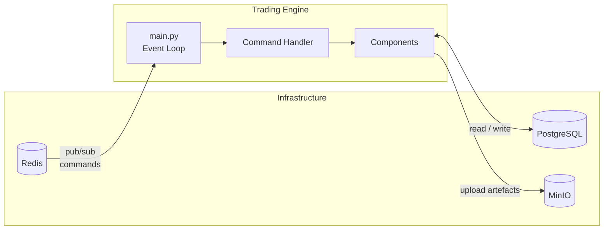

### 1.2 Boot Sequence

When the container starts, an entrypoint script runs two Python processes in sequence: a one-off **startup** script and then the long-running **main** process.

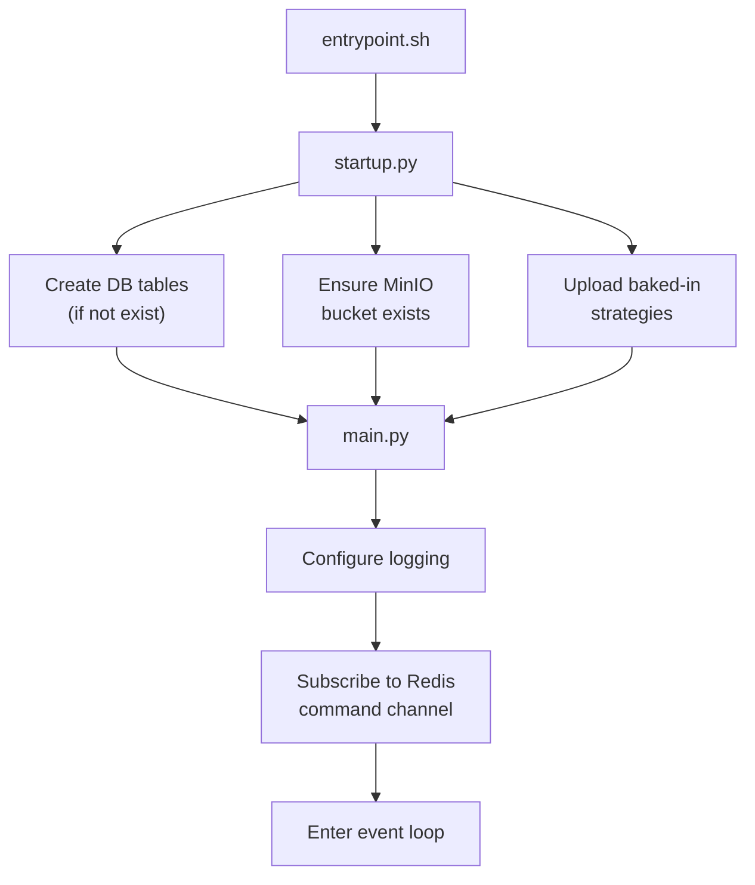

The startup script guarantees the database schema and object store bucket are ready before the engine begins accepting commands. It also discovers strategy implementations bundled with the image and inserts them into the platform so they are available immediately.

### 1.3 Command Dispatch

The event loop in `main.py` listens on a Redis pub/sub channel. Each incoming message is a JSON object with a `type` field and a `payload` field. The `CommandHandler` maintains a registry of handler functions, each decorated with the command name they serve. When a message arrives, the handler for the matching command type is invoked with the payload.

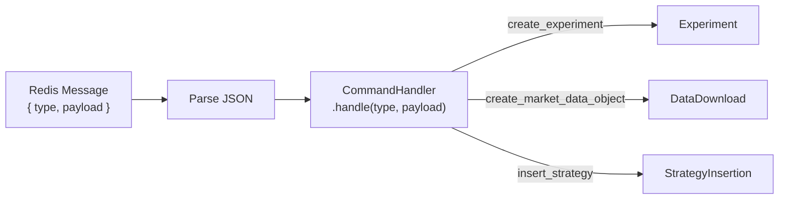

Three commands are registered:

| Command | Component | Description |
|---|---|---|
| `create_experiment` | `Experiment` | Run a full experiment with one or more trials |
| `create_market_data_object` | `DataDownload` | Download and store OHLCV market data |
| `insert_strategy` | `StrategyInsertion` | Validate and store a new strategy |

---

## 2. Components Module

### 2.1 Overview

The components module (`axiomara/components/`) contains four classes that represent the engine's top-level use cases. Each class encapsulates a complete workflow — from input validation through execution to persistence — and is invoked by the command dispatch layer.

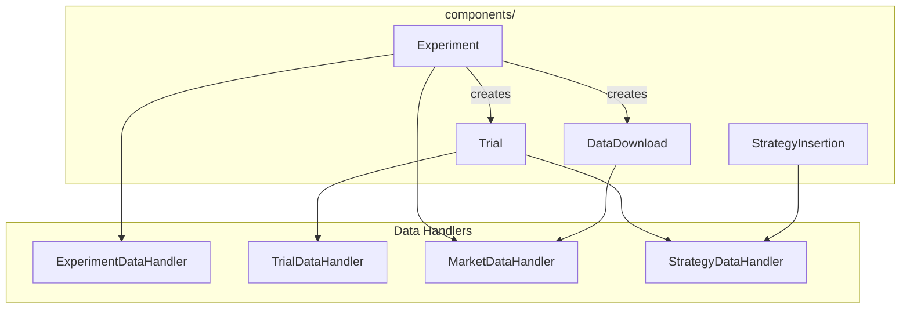

The four components divide cleanly into two categories:

- **Orchestration components** — `Experiment` and `Trial` coordinate strategy execution, data management, and result persistence.
- **Standalone components** — `DataDownload` and `StrategyInsertion` perform a single focused task and can be invoked independently.

### 2.2 Component Lifecycle Pattern

All four components follow the same context-manager pattern. They are instantiated with configuration, used inside a `with` block, and guarantee cleanup on exit regardless of success or failure.

```mermaid
statediagram-v2
  [*] --> Init: __init__()
  Init --> Running: __enter__()
  Running --> Running: run()
  Running --> Completing: __exit__()
  Completing --> [*]: _complete() → _cleanup()
```

This pattern ensures that every component persists its final status and releases resources even when an exception occurs during execution.

---

## 3. Experiment

### 3.1 Purpose

The `Experiment` component runs a complete backtesting experiment. An experiment consists of one or more **trials**, each testing a strategy with a different set of parameters against shared market data. The experiment also computes benchmark performance so trial results can be compared against a reference asset.

### 3.2 Experiment Flow

The diagram below shows the full lifecycle of an experiment, from configuration validation through trial execution to final completion.

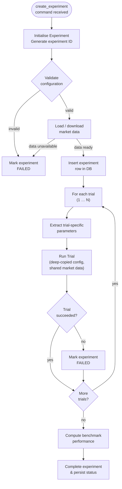

### 3.3 Configuration Validation

Before any data is loaded or any trial runs, the experiment validates its configuration against three rules:

1. **Trial count vs. parameter count** — Every strategy parameter must supply at least as many values as there are trials. If a parameter has fewer values than the number of trials, the experiment is rejected.
2. **Backtesting window vs. candle interval** — The backtesting cycle window must be larger than or equal to the candle interval. A window smaller than a single candle would produce meaningless cycles.
3. **EAC consistency** — For each trial, every combination of exchange (from `initial_investment`) and asset (from `initial_allocation_assets`) must appear in the `trading_eac` list. This guarantees the strategy can only trade assets for which market data will be available.

### 3.4 Data Loading

The experiment supports two data-loading paths:

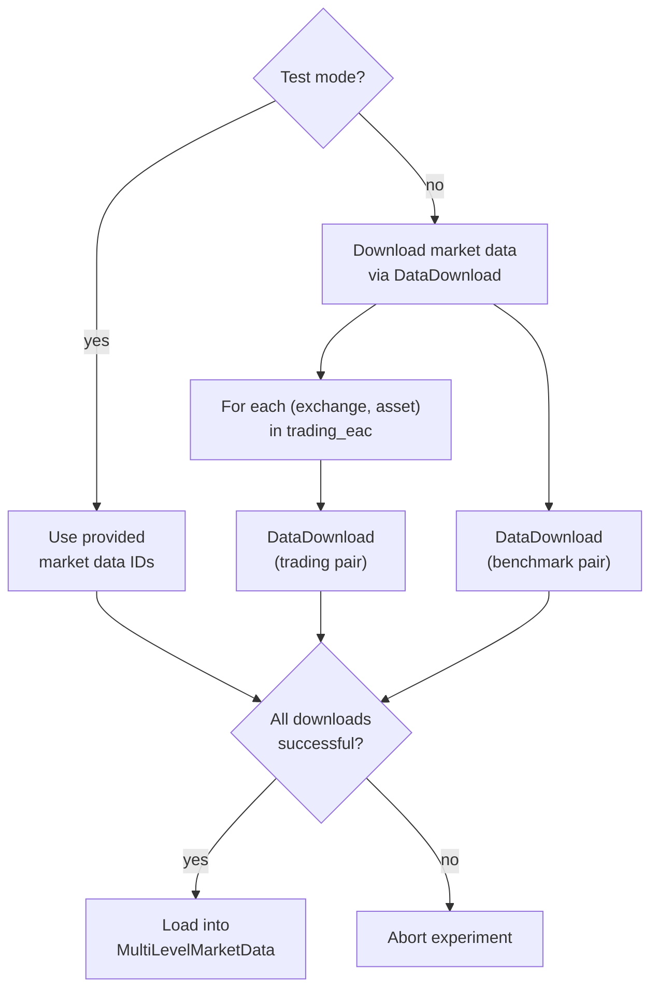

In production mode, the experiment creates a `DataDownload` instance for each trading pair and for the benchmark pair. In test mode, it skips the download and references pre-existing data by ID. Either way, all data statuses are verified before proceeding.

Once loaded, market data is stored as a `MultiLevelMarketData` object and **shared by reference** across all trials. Trials treat this data as read-only.

### 3.5 Trial Loop

Trials run sequentially. For each trial index, the experiment:

1. Extracts that trial's parameter values from the strategy parameters dictionary.
2. Generates a unique trial ID.
3. Deep-copies the experiment configuration so the trial receives an independent snapshot.
4. Passes the configuration, trial ID, parameters, and the shared market data to a new `Trial` instance.
5. Records the trial's status; if any trial fails, the experiment is marked as failed but continues running remaining trials.

### 3.6 Benchmark Performance

After all trials complete, the experiment computes benchmark performance by iterating over every candle in the benchmark data series. It records closing prices at each timestamp as if the initial investment had been placed in the benchmark asset. The resulting performance data is persisted alongside the experiment, allowing the frontend to overlay benchmark returns against trial results.

---

## 4. Trial

### 4.1 Purpose

The `Trial` component runs a single backtesting simulation. It loads a strategy, feeds it progressively revealed market data across a series of cycles, and records performance metrics and trading operations at each step.

### 4.2 Trial Flow

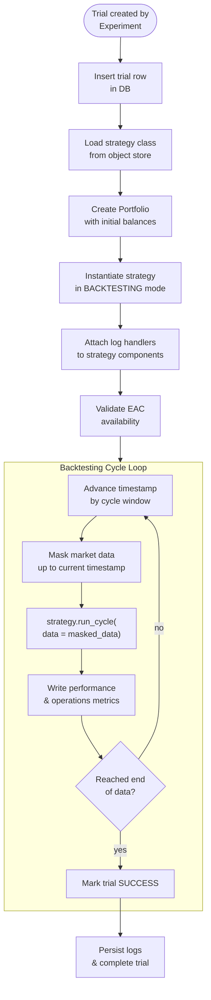

### 4.3 Backtesting Cycle

Each backtesting cycle simulates the passage of time. The trial starts at the experiment's `since` timestamp and advances by `backtesting_cycle_window` milliseconds on each iteration.

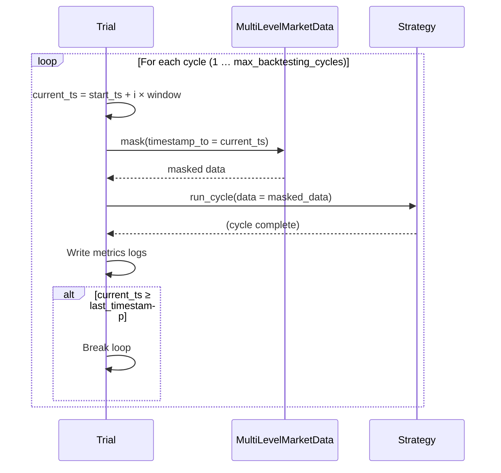

By masking the market data to the current timestamp, the trial ensures that the strategy can only see data that would have been available at that point in time — preventing look-ahead bias.

### 4.4 Metrics and Logging

At the end of each cycle the trial records two categories of metrics:

**Performance metrics** — portfolio value, return on investment (ROI), and net profit, computed by the `TrialPerformance` utility using the current portfolio value against the initial investment.

**Operations metrics** — total filled orders, total completed transfers, and total fees paid, read directly from the strategy's `TradingManager`.

Trial logs are streamed to a local file via dedicated log handlers that are attached to the strategy, trading manager, risk manager, and rebalancer loggers. On trial completion (or failure), these logs are persisted to MinIO object storage. If the trial fails, the traceback is also captured and stored separately.

---

## 5. DataDownload

### 5.1 Purpose

The `DataDownload` component fetches historical OHLCV (Open, High, Low, Close, Volume) candlestick data from a cryptocurrency exchange and stores it in PostgreSQL. It also implements a deduplication mechanism to avoid re-downloading data that already exists.

### 5.2 Download Flow

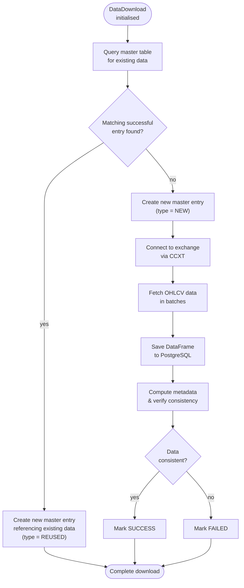

### 5.3 Data Reuse

Before downloading, `DataDownload` queries the master market data table for an existing entry with the same exchange, pair, date range, and candle interval that has a `SUCCESS` status. If found, it creates a new master table entry that points to the same underlying data table — avoiding a redundant network call and saving storage.

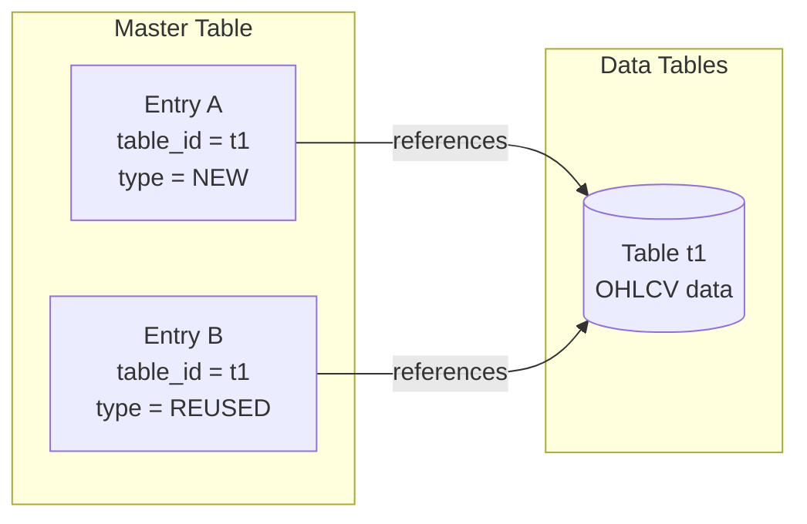

### 5.4 Consistency Verification

After downloading, the component verifies that the data covers the requested time range. It checks two conditions:

1. The **first candle timestamp** must be within one candle interval of the requested `since` timestamp.
2. The **last candle timestamp** must be within one candle interval of the requested `until` timestamp.

If either condition fails, the download is marked as inconsistent and its status is set to `FAILED`. The metadata (including the consistency flag) is persisted to the master table regardless, so operators can diagnose the issue.

The download process uses paginated requests with a configurable batch size and a configurable sleep interval between batches, both read from the engine's `config.yaml`. This protects against exchange rate limits and keeps memory usage predictable.

---

## 6. StrategyInsertion

### 6.1 Purpose

The `StrategyInsertion` component takes raw Python source code for a trading strategy, validates it, and registers it in the platform so it can be used in future experiments. It is the runtime equivalent of the startup script's baked-in strategy upload, but triggered on demand via a Redis command.

### 6.2 Insertion Pipeline

The insertion process is a strict sequential pipeline. If any step fails, the strategy is rejected and the failure reason is logged.

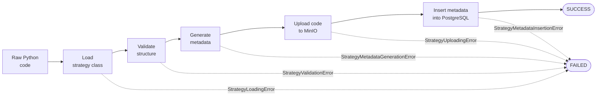

Each step is handled by the `StrategyDataHandler`:

| Step | Description |
|---|---|
| **Load** | Dynamically imports the raw code and extracts the strategy class |
| **Validate** | Checks that the class conforms to the `BaseStrategy` interface |
| **Generate metadata** | Extracts the strategy name, version, parameter definitions, and required EACs |
| **Upload** | Writes the strategy source code to MinIO object storage |
| **Insert metadata** | Creates a row in the `strategies` PostgreSQL table with the extracted metadata |

Each failure type has a dedicated exception class, allowing the component to log a precise diagnostic message for the specific stage that failed.

---

## 7. Component Interactions

The diagram below shows how the four components interact with each other and with the strategy and trading modules during a full experiment run.

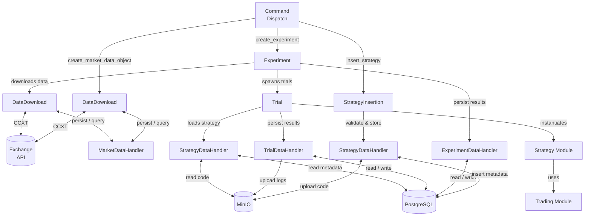

The components module acts as the engine's orchestration layer. It translates external commands into coordinated workflows that span the strategy module, the trading module, and the persistence layer — while keeping each concern cleanly separated behind data handler interfaces.
