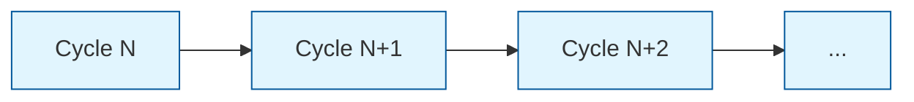
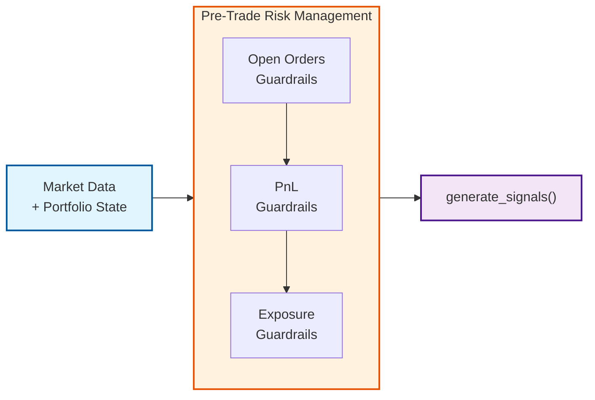
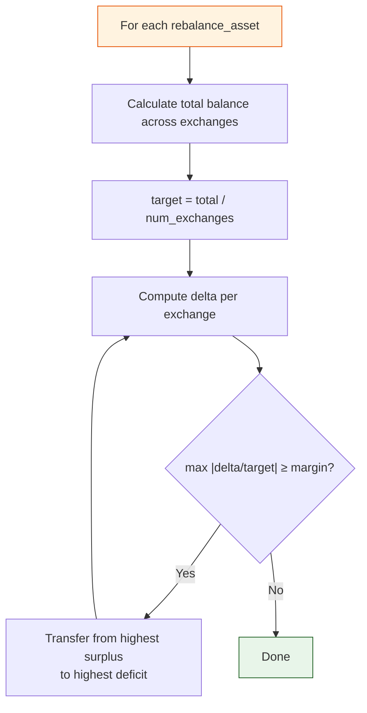
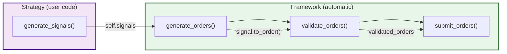
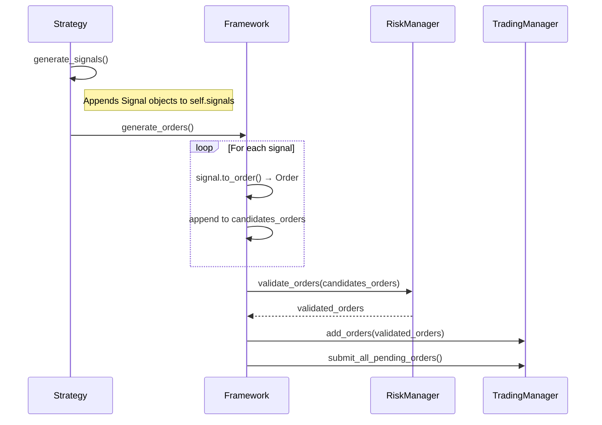
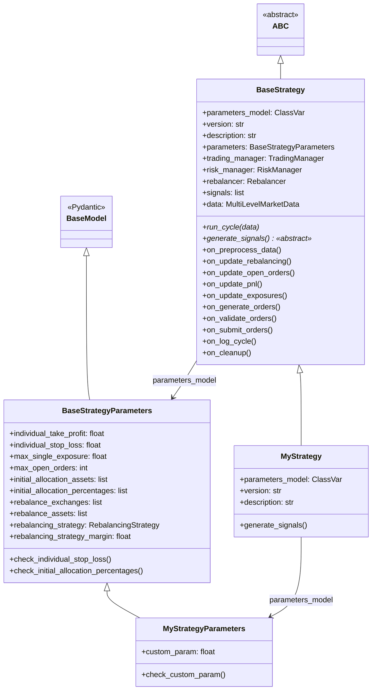

# Strategy Framework Overview

The Axiomara strategy framework provides a structured, signal-based approach to building quantitative trading strategies. Rather than managing orders directly, strategy authors implement a single `generate_signals()` method, and the framework takes care of order conversion, risk validation, and submission. Strategies run in repeating cycles -- each cycle ingests fresh market data, enforces risk guardrails, executes user-defined logic, and submits validated orders -- giving developers a clear, hook-driven lifecycle they can extend at every stage. This document is a comprehensive reference: it covers the execution flow, the signal architecture, the strategy creation process, the full API surface, and the mechanisms for loading and discovering strategies.

## Table of Contents

1. [Strategy Execution Flow](#1-strategy-execution-flow)
   - 1.1 [Cycle Overview](#11-cycle-overview)
   - 1.2 [Detailed Cycle Steps](#12-detailed-cycle-steps)
   - 1.3 [Hook Execution Order and Contracts](#13-hook-execution-order-and-contracts)
   - 1.4 [Risk Management Process](#14-risk-management-process)
   - 1.5 [Rebalancing Process](#15-rebalancing-process)
2. [Signal-Based Architecture](#2-signal-based-architecture)
   - 2.1 [Architecture Overview](#21-architecture-overview)
   - 2.2 [Signal Class Structure](#22-signal-class-structure)
   - 2.3 [Signal-to-Order Conversion Pipeline](#23-signal-to-order-conversion-pipeline)
   - 2.4 [Position Sizing](#24-position-sizing)
3. [Strategy Creation](#3-strategy-creation)
   - 3.1 [Class Hierarchy](#31-class-hierarchy)
   - 3.2 [BaseStrategyParameters](#32-basestrategyparameters)
   - 3.3 [Parameter Validation](#33-parameter-validation)
   - 3.4 [Implementing generate_signals()](#34-implementing-generate_signals)
   - 3.5 [Data Access Patterns](#35-data-access-patterns)
   - 3.6 [CandleFocus Enum](#36-candlefocus-enum)
   - 3.7 [Available Hooks](#37-available-hooks)
   - 3.8 [Logging with LogKey](#38-logging-with-logkey)
   - 3.9 [Error Handling Patterns](#39-error-handling-patterns)
4. [API Reference](#4-api-reference)
   - 4.1 [BaseStrategy Methods](#41-basestrategy-methods)
   - 4.2 [BaseStrategyParameters Fields](#42-basestrategyparameters-fields)
   - 4.3 [Signal Class](#43-signal-class)
   - 4.4 [MultiLevelMarketData Methods](#44-multilevelmarketdata-methods)
5. [Strategy Loading and Discovery](#5-strategy-loading-and-discovery)
   - 5.1 [Baked-in Strategies](#51-baked-in-strategies)
   - 5.2 [Startup Discovery Process](#52-startup-discovery-process)
   - 5.3 [API-Based Insertion](#53-api-based-insertion)
   - 5.4 [Strategy Validation Pipeline](#54-strategy-validation-pipeline)

---

## 1. Strategy Execution Flow

### 1.1 Cycle Overview

Strategies in the Axiomara framework operate in **cycles**. Each cycle represents a complete iteration through the strategy logic, from data ingestion to order submission. The `run_cycle()` method on `BaseStrategy` orchestrates the entire sequence.



Each cycle receives a `MultiLevelMarketData` snapshot and progresses through five phases: **Data Processing**, **Initial Allocation** (first cycle only), **Risk Management**, **Strategy Logic**, and **Order Execution**.

### 1.2 Detailed Cycle Steps

The following diagram shows every step executed within a single cycle, grouped by category. Each framework method is followed by its corresponding `on_xxx` hook (where applicable), allowing strategy implementations to inject custom logic at every stage.

```mermaid
flowchart TD
    START([run_cycle]) --> UD["update_data()"]

    subgraph DATA ["Data Processing"]
        direction TB
        UD --> PP["preprocess_data()"]
        PP --> H_PP["on_preprocess_data()"]
    end

    H_PP --> INIT_CHECK{First cycle?}

    subgraph INIT ["Initial Allocation (first cycle only)"]
        direction TB
        IAA["apply_initial_assets_allocation()"]
    end

    INIT_CHECK -- Yes --> IAA --> RM_START
    INIT_CHECK -- No --> RM_START

    subgraph RISK ["Risk Management"]
        direction TB
        RM_START["update_rebalancing()"] --> H_REB["on_update_rebalancing()"]
        H_REB --> AR["apply_rebalancing()"]
        AR --> UOO["update_open_orders()"]
        UOO --> H_OO["on_update_open_orders()"]
        H_OO --> AOO["apply_open_orders_guardrails()"]
        AOO --> UPNL["update_pnl()"]
        UPNL --> H_PNL["on_update_pnl()"]
        H_PNL --> APNL["apply_pnl_guardrails()"]
        APNL --> UE["update_exposures()"]
        UE --> H_EXP["on_update_exposures()"]
        H_EXP --> AE["apply_exposure_guardrails()"]
    end

    subgraph STRATEGY ["Strategy Logic"]
        direction TB
        GS["generate_signals()"]
    end

    AE --> GS

    subgraph EXECUTION ["Order Execution & Cleanup"]
        direction TB
        GO["generate_orders()"] --> H_GO["on_generate_orders()"]
        H_GO --> VO["validate_orders()"]
        VO --> H_VO["on_validate_orders()"]
        H_VO --> SO["submit_orders()"]
        SO --> H_SO["on_submit_orders()"]
        H_SO --> LC["log_cycle()"]
        LC --> H_LC["on_log_cycle()"]
        H_LC --> CL["cleanup()"]
        CL --> H_CL["on_cleanup()"]
    end

    GS --> GO

    H_CL --> END([End cycle])

    style DATA fill:#e1f5fe,stroke:#01579b,stroke-width:2px,color:#01579b
    style INIT fill:#e0f2f1,stroke:#00695c,stroke-width:2px,color:#00695c
    style RISK fill:#fff3e0,stroke:#e65100,stroke-width:2px,color:#e65100
    style STRATEGY fill:#f3e5f5,stroke:#4a148c,stroke-width:2px,color:#4a148c
    style EXECUTION fill:#e8f5e9,stroke:#1b5e20,stroke-width:2px,color:#1b5e20
```



| Phase | Color | Description |
|-------|-------|-------------|
| Data Processing | Blue | Ingest and preprocess market data |
| Initial Allocation | Teal | One-time portfolio seeding (first cycle only) |
| Risk Management | Orange | Rebalancing, open-order guardrails, PnL guardrails, exposure guardrails |
| Strategy Logic | Purple | Core signal generation (user-implemented) |
| Order Execution & Cleanup | Green | Convert signals to orders, validate, submit, log, reset state |

### 1.3 Hook Execution Order and Contracts

Every framework step that supports customization is paired with an `on_xxx` hook called **immediately after** the base implementation. Hooks have no return value and are optional -- the default implementations are no-ops.

The following table documents each hook in exact execution order, the framework method it follows, and its contract:

| # | Framework Method | Hook | Contract / Use Case |
|---|------------------|------|---------------------|
| 1 | `preprocess_data()` | `on_preprocess_data()` | Custom data transformations. `self.data` is available and populated. |
| 2 | `update_rebalancing()` | `on_update_rebalancing()` | Inspect or modify `self.rebalancing_transfers` before they are applied. |
| 3 | `update_open_orders()` | `on_update_open_orders()` | Inspect or modify `self.open_orders_to_cancel` before cancellation. |
| 4 | `update_pnl()` | `on_update_pnl()` | Inspect or modify `self.pnl_guardrails_orders` before they are submitted. |
| 5 | `update_exposures()` | `on_update_exposures()` | Inspect or modify `self.exposure_guardrails_orders` before they are submitted. |
| 6 | `generate_orders()` | `on_generate_orders()` | Inspect or modify `self.candidates_orders` after signals have been converted. |
| 7 | `validate_orders()` | `on_validate_orders()` | Inspect or modify `self.validated_orders` before submission. |
| 8 | `submit_orders()` | `on_submit_orders()` | Post-submission logic (e.g., analytics, notifications). |
| 9 | `log_cycle()` | `on_log_cycle()` | Append custom logging after the framework logs cycle execution time. |
| 10 | `cleanup()` | `on_cleanup()` | Custom cleanup. All temporary lists (`signals`, `candidates_orders`, etc.) have been reset. |

### 1.4 Risk Management Process

Risk management runs **before** the strategy's `generate_signals()` method, ensuring that guardrails are enforced proactively. It operates through three independent subsystems executed in sequence:



#### 1.4.1 Open Orders Guardrails

Manages the lifecycle of outstanding orders.

- Retrieves all currently submitted (unfilled) orders from the orderbook
- Cancels stale orders that exceed the maximum age threshold
- Enforces the `max_open_orders` limit

#### 1.4.2 PnL Guardrails (Take Profit / Stop Loss)

Enforces per-position profit and loss thresholds.

- Iterates over all open positions in the portfolio
- Calculates unrealized PnL percentage for each position: `unrealized_pnl / position.value`
- Generates automatic **SELL MARKET** orders when:
  - Unrealized PnL % > `individual_take_profit` (e.g., > 20%)
  - Unrealized PnL % < `individual_stop_loss` (e.g., < -20%)
- Orders are submitted immediately within the same cycle

#### 1.4.3 Exposure Guardrails

Prevents over-concentration in a single asset.

- Computes current exposure per asset: `asset_value / total_portfolio_value`
- When exposure exceeds `max_single_exposure`, generates **SELL MARKET** orders to reduce the position back to the limit
- Sell quantities are distributed across positions of the over-exposed asset

### 1.5 Rebalancing Process

Rebalancing maintains the desired distribution of base currency assets across exchanges. It runs **before** risk management in each cycle.

#### 1.5.1 Rebalancing Strategies

| Strategy | Enum Value | Behavior |
|----------|------------|----------|
| **Uniform** | `RebalancingStrategy.UNIFORM` | Distributes each rebalance asset equally across all configured exchanges via inter-exchange transfers |
| **None** | `RebalancingStrategy.NONE` | Disables automatic rebalancing entirely |

#### 1.5.2 Rebalancing Configuration

| Parameter | Type | Default | Description |
|-----------|------|---------|-------------|
| `rebalance_exchanges` | `list[str]` | `["binance"]` | Exchanges to include in rebalancing. Rebalancing only activates when **more than one** exchange is configured. |
| `rebalance_assets` | `list[str]` | `["USDT"]` | Assets to rebalance across exchanges |
| `rebalancing_strategy` | `RebalancingStrategy` | `UNIFORM` | Algorithm used for rebalancing |
| `rebalancing_strategy_margin` | `float` | `0.01` | Minimum deviation from target (as ratio of target balance) before a transfer is generated |

#### 1.5.3 Uniform Rebalancing Algorithm



---

## 2. Signal-Based Architecture

### 2.1 Architecture Overview

The framework uses a **signal-based architecture** where strategies generate `Signal` objects instead of managing orders directly. This separation provides:

- **Decoupled strategy logic** -- strategies focus on *what* to trade, not *how*
- **Automatic order management** -- the framework handles conversion, validation, and submission
- **Risk integration** -- all orders pass through the `RiskManager.validate_orders()` gate before submission



### 2.2 Signal Class Structure

A `Signal` encapsulates all information needed to create an order. Defined in `axiomara/trading/signal.py`:

```python
from axiomara.trading.signal import Signal
from axiomara.trading.enums import OrderSide, OrderType, OrderTIF

signal = Signal(
    pair="BTC/USDT",                    # Trading pair
    side=OrderSide.BUY,                 # BUY or SELL
    qty=0.05,                           # Quantity to trade
    exchange="binance",                 # Target exchange
    price=42000.0,                      # Optional: price for limit orders (None = market)
    order_creation_ts=1700000000000,    # Optional: creation timestamp
    order_time_in_force=OrderTIF.GTC,   # Optional: defaults to GTC
    order_type=OrderType.MARKET,        # Optional: defaults to MARKET
)
```

| Parameter | Type | Required | Default | Description |
|-----------|------|----------|---------|-------------|
| `pair` | `str` | Yes | -- | Trading pair (e.g., `"BTC/USDT"`) |
| `side` | `OrderSide` | Yes | -- | `OrderSide.BUY` or `OrderSide.SELL` |
| `qty` | `float` | Yes | -- | Quantity to trade in base asset units |
| `exchange` | `str` | Yes | -- | Exchange to execute on |
| `price` | `float` | No | `None` | Price for limit orders. `None` implies market order. |
| `order_creation_ts` | `int` | No | `None` | Order creation timestamp (milliseconds). If `None`, current time is used. |
| `order_time_in_force` | `OrderTIF` | No | `OrderTIF.GTC` | `GTC` (Good Till Canceled) or `day` |
| `order_type` | `OrderType` | No | `OrderType.MARKET` | `MARKET` or `LIMIT` |

### 2.3 Signal-to-Order Conversion Pipeline



The `to_order()` method on `Signal` performs a direct mapping:

```python
def to_order(self) -> Order:
    return Order(
        pair=self.pair,
        side=self.side,
        price=self.price,
        qty=self.qty,
        exchange=self.exchange,
        time_in_force=self.order_time_in_force,
        order_type=self.order_type,
        creation_ts=self.order_creation_ts,
    )
```

### 2.4 Position Sizing

Position sizing is the responsibility of the strategy within `generate_signals()`. A common pattern is to size positions as a fixed percentage of total portfolio value:

```python
def generate_signals(self) -> None:
    for exchange, pair in self.data.get_exchange_pair_combinations():
        _, current_price = self.data.get_value_from_candle(
            exchange, pair, CandleFocus.CLOSE.value, index=-1
        )

        # Calculate position size: 1% of portfolio value
        market_prices = self.data.get_current_market_prices(
            portfolio_currency=self.trading_manager.portfolio.portfolio_currency
        )
        portfolio_value = self.trading_manager.portfolio.get_total_value(market_prices)
        position_value = portfolio_value * 0.01  # 1% allocation
        qty = position_value / current_price

        signal = Signal(
            pair=pair,
            side=OrderSide.BUY,
            qty=qty,
            exchange=exchange,
            price=current_price,
            order_creation_ts=self.data.last_timestamp,
        )
        self.signals.append(signal)
```

> **Note**: The `max_single_exposure` guardrail in the `RiskManager` provides a safety net regardless of how positions are sized in the strategy.

---

## 3. Strategy Creation

### 3.1 Class Hierarchy

All strategies inherit from `BaseStrategy` and define their parameters through a companion `BaseStrategyParameters` subclass.



#### Minimal Strategy Skeleton

```python
from typing import ClassVar, Type
from pydantic import Field, field_validator

from axiomara.strategy.strategy import BaseStrategy, BaseStrategyParameters
from axiomara.trading.enums import OrderSide, CandleFocus
from axiomara.trading.signal import Signal
from shared.logging.logs import LogKey


class MyStrategyParameters(BaseStrategyParameters):
    """Custom parameters for MyStrategy."""

    lookback_periods: int = Field(
        default=20,
        description="Number of periods for the moving average"
    )

    @field_validator("lookback_periods")
    def check_lookback_periods(cls, v: int) -> int:
        if v < 2:
            raise ValueError("lookback_periods must be at least 2")
        return v


class MyStrategy(BaseStrategy):
    """A custom trading strategy."""

    parameters_model: ClassVar[Type[MyStrategyParameters]] = MyStrategyParameters
    version: str = "1.0.0"
    description: str = "My custom trading strategy"

    def generate_signals(self) -> None:
        for exchange, pair in self.data.get_exchange_pair_combinations():
            try:
                _, current_price = self.data.get_value_from_candle(
                    exchange, pair, CandleFocus.CLOSE.value, index=-1
                )

                # Strategy logic here...

                signal = Signal(
                    pair=pair,
                    side=OrderSide.BUY,
                    qty=0.01,
                    exchange=exchange,
                    price=current_price,
                    order_creation_ts=self.data.last_timestamp,
                )
                self.signals.append(signal)

            except (IndexError, ValueError) as e:
                self.logger.log(
                    LogKey.STRATEGY_CUSTOM_WARNING,
                    message=f"Insufficient data for {pair} on {exchange}: {e}",
                )
                continue
```

### 3.2 BaseStrategyParameters

The `BaseStrategyParameters` class (Pydantic `BaseModel`) defines common parameters inherited by all strategies:

| Parameter | Type | Default | Description |
|-----------|------|---------|-------------|
| `individual_take_profit` | `float` | `0.2` | Per-position take profit threshold (20%) |
| `individual_stop_loss` | `float` | `-0.2` | Per-position stop loss threshold (-20%). Must be in `(-1, 0)`. |
| `max_single_exposure` | `float` | `0.2` | Maximum portfolio exposure to a single asset (20%) |
| `max_open_orders` | `int` | `10` | Maximum number of concurrent open orders |
| `initial_allocation_assets` | `list` | `["BTC"]` | Assets to buy during the initial allocation phase (first cycle) |
| `initial_allocation_percentages` | `list` | `[0.5]` | Percentage of initial balance to allocate to each asset. Must match the length of `initial_allocation_assets`. Values in `[0, 1]`. |
| `rebalance_exchanges` | `list` | `["binance"]` | Exchanges included in rebalancing |
| `rebalance_assets` | `list` | `["USDT"]` | Assets to rebalance across exchanges |
| `rebalancing_strategy` | `RebalancingStrategy` | `UNIFORM` | Rebalancing algorithm |
| `rebalancing_strategy_margin` | `float` | `0.01` | Deviation threshold before rebalancing triggers |

### 3.3 Parameter Validation

Parameters are validated using **Pydantic field validators** (`@field_validator`) for single-field checks and **model validators** (`@model_validator`) for cross-field checks.

#### Single-Field Validation

```python
from pydantic import Field, field_validator

class MyStrategyParameters(BaseStrategyParameters):
    momentum_threshold: float = Field(
        default=0.001,
        description="Minimum momentum for signal generation"
    )

    @field_validator("momentum_threshold")
    def check_momentum_threshold(cls, v: float) -> float:
        """Validate that momentum_threshold is positive."""
        if v <= 0:
            raise ValueError("momentum_threshold must be positive")
        return v
```

#### Cross-Field Validation

The base class includes a `@model_validator` example that validates `initial_allocation_percentages` against `initial_allocation_assets`:

```python
from pydantic import model_validator

@model_validator(mode="after")
def check_initial_allocation_percentages(self):
    if len(self.initial_allocation_percentages) != len(self.initial_allocation_assets):
        raise ValueError(
            "initial_allocation_percentages must have the "
            "same number of elements as initial_allocation_assets."
        )
    for percentage in self.initial_allocation_percentages:
        if percentage < 0 or percentage > 1:
            raise ValueError("initial_allocation_percentages must be between 0 and 1")
    return self
```

<details>
<summary>Built-in validators on BaseStrategyParameters</summary>

| Validator | Target | Rule |
|-----------|--------|------|
| `check_individual_stop_loss` | `individual_stop_loss` | Must be in range `(-1, 0)` exclusive |
| `check_initial_allocation_percentages` | `initial_allocation_percentages` + `initial_allocation_assets` | Lengths must match; each value in `[0, 1]` |

</details>

### 3.4 Implementing generate_signals()

`generate_signals()` is the **only abstract method** on `BaseStrategy` and represents the core strategy logic. Its responsibility is to populate `self.signals` with `Signal` objects. The framework handles everything else: conversion to orders, risk validation, and submission.

**Contract:**
- **Input**: Access market data via `self.data`, portfolio state via `self.trading_manager.portfolio`, and parameters via `self.parameters`
- **Output**: Append `Signal` objects to `self.signals`
- **Side effects**: None required. Do not submit orders directly.

```python
def generate_signals(self) -> None:
    """Momentum strategy: buy on positive price change, sell on negative."""
    for exchange, pair in self.data.get_exchange_pair_combinations():
        try:
            _, current_price = self.data.get_value_from_candle(
                exchange, pair, CandleFocus.CLOSE.value, index=-1
            )
            _, historical_price = self.data.get_value_from_candle(
                exchange, pair, CandleFocus.CLOSE.value,
                index=-(self.parameters.lookback_periods + 1)
            )

            price_change = (current_price - historical_price) / historical_price

            if price_change > self.parameters.threshold:
                side = OrderSide.BUY
            elif price_change < -self.parameters.threshold:
                side = OrderSide.SELL
            else:
                continue

            # Position sizing
            market_prices = self.data.get_current_market_prices(
                portfolio_currency=self.trading_manager.portfolio.portfolio_currency
            )
            portfolio_value = self.trading_manager.portfolio.get_total_value(
                market_prices
            )
            qty = (portfolio_value * 0.01) / current_price

            signal = Signal(
                pair=pair,
                side=side,
                qty=qty,
                exchange=exchange,
                price=current_price,
                order_creation_ts=self.data.last_timestamp,
            )
            self.signals.append(signal)

            self.logger.log(
                LogKey.STRATEGY_CUSTOM_INFO,
                message=f"Generated {side.value} signal for {pair} on {exchange}: "
                        f"price={current_price}, qty={qty:.6f}",
            )

        except (IndexError, ValueError) as e:
            self.logger.log(
                LogKey.STRATEGY_CUSTOM_WARNING,
                message=f"Insufficient data for {pair} on {exchange}: {e}",
            )
            continue
        except Exception as e:
            self.logger.log(
                LogKey.STRATEGY_CUSTOM_WARNING,
                message=f"Error processing {pair} on {exchange}: {e}",
            )
            continue
```

### 3.5 Data Access Patterns

Strategies access market data through `self.data`, which is a `MultiLevelMarketData` instance populated at the beginning of each cycle.

#### 3.5.1 Iterating Over Exchange-Pair Combinations

```python
for exchange, pair in self.data.get_exchange_pair_combinations():
    # exchange: str (e.g., "binance")
    # pair: str (e.g., "BTC/USDT")
    pass
```

Returns a `List[Tuple[str, str]]` of all `(exchange, pair)` combinations present in the data.

#### 3.5.2 Reading Candle Values

```python
# Get the most recent close price
timestamp, current_price = self.data.get_value_from_candle(
    exchange, pair, CandleFocus.CLOSE.value, index=-1
)

# Get the close price 20 candles ago
timestamp, historical_price = self.data.get_value_from_candle(
    exchange, pair, CandleFocus.CLOSE.value, index=-21
)

# Get the current volume
timestamp, current_volume = self.data.get_value_from_candle(
    exchange, pair, CandleFocus.VOLUME.value, index=-1
)
```

| Parameter | Type | Description |
|-----------|------|-------------|
| `exchange` | `str` | Exchange name |
| `pair` | `str` | Trading pair |
| `candle_focus` | `str` | Candle element to read. Use `CandleFocus.<ELEMENT>.value`. |
| `index` | `int` | Candle index. `-1` is the latest, `-2` the previous, etc. |

**Returns**: `Tuple[int, float]` -- `(timestamp, value)`

**Raises**: `KeyError` if exchange/pair not found, `IndexError` if index out of range.

#### 3.5.3 Current Market Prices

```python
market_prices = self.data.get_current_market_prices(
    portfolio_currency=self.trading_manager.portfolio.portfolio_currency
)
# Returns: {"BTC": 42000.0, "ETH": 2200.0, "USDT": 1.0, ...}
```

### 3.6 CandleFocus Enum

Defined in `axiomara/trading/enums.py`, specifies which element of an OHLCV candle to access:

| Member | Value | Description |
|--------|-------|-------------|
| `CandleFocus.OPEN` | `"open"` | Opening price of the candle period |
| `CandleFocus.HIGH` | `"high"` | Highest price during the candle period |
| `CandleFocus.LOW` | `"low"` | Lowest price during the candle period |
| `CandleFocus.CLOSE` | `"close"` | Closing price of the candle period |
| `CandleFocus.VOLUME` | `"volume"` | Trading volume during the candle period |

> **Usage**: Always pass `CandleFocus.<MEMBER>.value` (the string) to `get_value_from_candle()`.

### 3.7 Available Hooks

All hooks are optional overrides with no-op defaults. Override them to inject custom logic at specific points in the cycle.

| Hook | Phase | Typical Use Cases |
|------|-------|-------------------|
| `on_preprocess_data()` | Data Processing | Compute derived indicators, cache preprocessed data |
| `on_update_rebalancing()` | Risk Management | Log or modify rebalancing transfers |
| `on_update_open_orders()` | Risk Management | Custom order cancellation logic |
| `on_update_pnl()` | Risk Management | Custom PnL tracking, alert systems |
| `on_update_exposures()` | Risk Management | Custom exposure monitoring |
| `on_generate_orders()` | Order Execution | Filter or modify candidate orders post-conversion |
| `on_validate_orders()` | Order Execution | Inspect validated orders, log validation results |
| `on_submit_orders()` | Order Execution | Post-submission analytics, notifications |
| `on_log_cycle()` | Cleanup | Append custom metrics to cycle log |
| `on_cleanup()` | Cleanup | Release custom resources, reset custom state |

<details>
<summary>Example: using on_preprocess_data() to cache indicators</summary>

```python
class MyStrategy(BaseStrategy):
    def on_preprocess_data(self) -> None:
        """Pre-compute RSI for all pairs."""
        self._rsi_cache = {}
        for exchange, pair in self.data.get_exchange_pair_combinations():
            prices = []
            for i in range(-self.parameters.rsi_period - 1, 1):
                try:
                    _, price = self.data.get_value_from_candle(
                        exchange, pair, CandleFocus.CLOSE.value, index=i
                    )
                    prices.append(price)
                except (IndexError, ValueError):
                    continue
            self._rsi_cache[(exchange, pair)] = self._calculate_rsi(prices)

    def generate_signals(self) -> None:
        for exchange, pair in self.data.get_exchange_pair_combinations():
            rsi = self._rsi_cache.get((exchange, pair))
            # Use cached RSI value...
```

</details>

### 3.8 Logging with LogKey

Strategy implementations should use the structured logging system via `self.logger.log()`. Four custom log keys are available at different severity levels:

| LogKey | Level | When to Use |
|--------|-------|-------------|
| `LogKey.STRATEGY_CUSTOM_DEBUG` | `DEBUG` | Verbose diagnostic information (e.g., intermediate calculations) |
| `LogKey.STRATEGY_CUSTOM_INFO` | `INFO` | Normal operational events (e.g., signal generation) |
| `LogKey.STRATEGY_CUSTOM_WARNING` | `WARNING` | Recoverable issues (e.g., insufficient data for a pair) |
| `LogKey.STRATEGY_CUSTOM_ERROR` | `ERROR` | Serious errors that may affect strategy correctness |

**Usage pattern:**

```python
from shared.logging.logs import LogKey

# Debug: verbose computation details
self.logger.log(
    LogKey.STRATEGY_CUSTOM_DEBUG,
    message="Computing Bollinger Bands for BTC/USDT: SMA=42000, std=500"
)

# Info: signal generation events
self.logger.log(
    LogKey.STRATEGY_CUSTOM_INFO,
    message=f"Generated BUY signal for {pair} on {exchange}: price={price}, qty={qty:.6f}"
)

# Warning: recoverable problems
self.logger.log(
    LogKey.STRATEGY_CUSTOM_WARNING,
    message=f"Insufficient data for {pair} on {exchange}: need 20 periods, got 5"
)

# Error: serious issues
self.logger.log(
    LogKey.STRATEGY_CUSTOM_ERROR,
    message=f"Failed to compute indicator for {pair}: {error}"
)
```

> **Note**: All custom log messages are passed via the `message` keyword argument.

### 3.9 Error Handling Patterns

Robust strategies must handle data access errors gracefully. The recommended pattern wraps per-pair processing in a try-catch block:

```python
def generate_signals(self) -> None:
    for exchange, pair in self.data.get_exchange_pair_combinations():
        try:
            # Access candle data (may raise IndexError if insufficient data)
            _, current_price = self.data.get_value_from_candle(
                exchange, pair, CandleFocus.CLOSE.value, index=-1
            )
            _, historical_price = self.data.get_value_from_candle(
                exchange, pair, CandleFocus.CLOSE.value,
                index=-(self.parameters.lookback_periods + 1)
            )

            # Strategy logic...
            signal = Signal(
                pair=pair, side=OrderSide.BUY, qty=qty,
                exchange=exchange, price=current_price,
                order_creation_ts=self.data.last_timestamp,
            )
            self.signals.append(signal)

        except (IndexError, ValueError) as e:
            # Expected: insufficient historical data for this pair
            self.logger.log(
                LogKey.STRATEGY_CUSTOM_WARNING,
                message=f"Insufficient data for {pair} on {exchange}: {e}",
            )
            continue

        except Exception as e:
            # Unexpected: log and continue to next pair
            self.logger.log(
                LogKey.STRATEGY_CUSTOM_WARNING,
                message=f"Error processing {pair} on {exchange}: {e}",
            )
            continue
```

**Key principles:**
- Catch `IndexError` and `ValueError` explicitly for data access issues
- Use a broad `Exception` catch as a safety net
- Always `continue` to the next pair instead of aborting
- Log warnings for skipped pairs to enable post-cycle debugging

---

## 4. API Reference

### 4.1 BaseStrategy Methods

#### Constructor

```python
def __init__(
    self,
    portfolio: Portfolio,
    running_mode: RunningMode,
    **kwargs
) -> None
```

Initializes the strategy. `**kwargs` are forwarded to the `parameters_model` Pydantic constructor for validation.

#### Cycle Execution

| Method | Signature | Description |
|--------|-----------|-------------|
| `run_cycle` | `(data: MultiLevelMarketData) -> None` | Executes a complete strategy cycle. Entry point called by the framework. |

#### Data Methods

| Method | Signature | Description |
|--------|-----------|-------------|
| `update_data` | `(data: MultiLevelMarketData) -> None` | Replaces `self.data` with latest market data and updates risk manager prices. |
| `preprocess_data` | `() -> None` | No-op by default. Override for custom data preprocessing. |

#### Risk Management Methods

| Method | Signature | Description |
|--------|-----------|-------------|
| `update_rebalancing` | `() -> None` | Prepares rebalancing transfers. Only activates with >1 exchange. |
| `apply_rebalancing` | `() -> None` | Submits rebalancing transfers via `TradingManager`. |
| `update_open_orders` | `() -> None` | Identifies stale open orders to cancel. |
| `apply_open_orders_guardrails` | `() -> None` | Cancels identified stale orders. |
| `update_pnl` | `() -> None` | Calculates unrealized PnL; generates TP/SL orders. |
| `apply_pnl_guardrails` | `() -> None` | Submits PnL guardrail orders. |
| `update_exposures` | `() -> None` | Calculates asset exposures; generates exposure reduction orders. |
| `apply_exposure_guardrails` | `() -> None` | Submits exposure guardrail orders. |

#### Strategy Logic

| Method | Signature | Description |
|--------|-----------|-------------|
| `generate_signals` | `() -> None` | **Abstract.** Must be overridden. Populate `self.signals` with `Signal` objects. |

#### Order Execution Methods

| Method | Signature | Description |
|--------|-----------|-------------|
| `generate_orders` | `() -> None` | Converts each `Signal` in `self.signals` to an `Order` via `signal.to_order()`. |
| `validate_orders` | `() -> None` | Passes `candidates_orders` through `RiskManager.validate_orders()`. |
| `submit_orders` | `() -> None` | Submits validated orders to the `TradingManager`. |

#### Utility Methods

| Method | Signature | Description |
|--------|-----------|-------------|
| `log_cycle` | `() -> None` | Logs cycle execution time via `LogKey.STRATEGY_CYCLE_EXECUTION_TIME`. |
| `cleanup` | `() -> None` | Resets `signals`, `candidates_orders`, `validated_orders`, `rebalancing_transfers` to empty lists. |

#### Hook Methods

| Method | Signature | Default |
|--------|-----------|---------|
| `on_preprocess_data` | `() -> None` | No-op |
| `on_update_rebalancing` | `() -> None` | No-op |
| `on_update_open_orders` | `() -> None` | No-op |
| `on_update_pnl` | `() -> None` | No-op |
| `on_update_exposures` | `() -> None` | No-op |
| `on_generate_orders` | `() -> None` | No-op |
| `on_validate_orders` | `() -> None` | No-op |
| `on_submit_orders` | `() -> None` | No-op |
| `on_log_cycle` | `() -> None` | No-op |
| `on_cleanup` | `() -> None` | No-op |

### 4.2 BaseStrategyParameters Fields

| Field | Type | Default | Validators | Description |
|-------|------|---------|------------|-------------|
| `individual_take_profit` | `float` | `0.2` | -- | Take profit threshold (e.g., 0.2 = 20%) |
| `individual_stop_loss` | `float` | `-0.2` | `check_individual_stop_loss`: must be in `(-1, 0)` | Stop loss threshold (e.g., -0.2 = -20%) |
| `max_single_exposure` | `float` | `0.2` | -- | Max portfolio fraction in one asset |
| `max_open_orders` | `int` | `10` | -- | Max concurrent open orders |
| `initial_allocation_assets` | `list` | `["BTC"]` | `check_initial_allocation_percentages` (model) | Assets for initial buy |
| `initial_allocation_percentages` | `list` | `[0.5]` | `check_initial_allocation_percentages` (model): length match + values in `[0, 1]` | Allocation fraction per asset |
| `rebalance_exchanges` | `list` | `["binance"]` | -- | Exchanges for rebalancing |
| `rebalance_assets` | `list` | `["USDT"]` | -- | Assets to rebalance |
| `rebalancing_strategy` | `RebalancingStrategy` | `UNIFORM` | -- | Rebalancing algorithm |
| `rebalancing_strategy_margin` | `float` | `0.01` | -- | Rebalancing activation threshold |

### 4.3 Signal Class

| Method | Signature | Description |
|--------|-----------|-------------|
| `__init__` | `(pair, side, qty, exchange, price?, order_creation_ts?, order_time_in_force?, order_type?)` | Create a signal. See [Section 2.2](#22-signal-class-structure) for parameter details. |
| `to_order` | `() -> Order` | Convert the signal to an `Order` object. Called automatically by the framework. |

### 4.4 MultiLevelMarketData Methods

| Method | Signature | Returns | Description |
|--------|-----------|---------|-------------|
| `get_exchange_pair_combinations` | `() -> List[Tuple[str, str]]` | List of `(exchange, pair)` | All available exchange-pair combinations in the data. |
| `get_value_from_candle` | `(exchange, pair, candle_focus, index=-1) -> Tuple[int, float]` | `(timestamp, value)` | Retrieve a specific candle value. Raises `KeyError` or `IndexError`. |
| `get_current_market_prices` | `(portfolio_currency, index=-1) -> Dict[str, float]` | Asset-to-price mapping | Latest close prices for all assets quoted in the portfolio currency. |
| `mask` | `(timestamp_to: int) -> MultiLevelMarketData` | New instance | Create a historical view of the data up to the given timestamp. |

---

## 5. Strategy Loading and Discovery

### 5.1 Baked-in Strategies

Strategies can be **baked into** the system by placing them in the `strategy/example_implementations` directory. Each strategy lives in its own subdirectory with a single `implementation.py` file:

```
axiomara/strategy/example_implementations/
├── mean_reversion_strategy/
│   └── implementation.py
├── momentum_strategy/
│   └── implementation.py
├── simple_trend_strategy/
│   └── implementation.py
└── error_strategy/
    └── implementation.py
```

#### Directory Structure Requirements

- Each strategy must be in its own directory: `<strategy_name>/implementation.py`
- The `implementation.py` file must contain:
  - A class inheriting from `BaseStrategyParameters` (custom parameters)
  - A class inheriting from `BaseStrategy` (strategy implementation)
- The strategy class must define `version` and `description` class attributes
- The strategy class must set `parameters_model` to point to the custom parameters class

### 5.2 Startup Discovery Process

On application startup, the `startup.py` script automatically discovers and registers all baked-in strategies:

**Steps in detail:**

1. **Database setup**: Creates `strategies`, `experiments`, `trials`, and `master_market_data` tables if they don't exist
2. **Object store setup**: Ensures the MinIO bucket exists
3. **Discovery**: Lists all subdirectories in `LOCAL_STRATEGIES_DIR` (skips `__pycache__` and hidden directories)
4. **Loading**: Reads each `implementation.py` as raw text, then dynamically loads it via `exec()`. Scans the resulting namespace for `BaseStrategy` and `BaseStrategyParameters` subclasses.
5. **Validation**: Validates strategy structure (extensible; currently a no-op placeholder)
6. **Metadata generation**: Extracts parameter names, types, defaults, and descriptions from the Pydantic model fields. Builds a `default_experiment_config`.
7. **Upload**: Writes the raw code to MinIO at `<strategies_dir>/<name>/<version>/implementation.py`
8. **Database insertion**: Inserts a metadata row into the `strategies` table (id, name, description, version, parameters JSON, default_experiment_config JSON)

### 5.3 API-Based Insertion

Strategies can also be added at runtime through the REST API:

#### Endpoints

| Method | Path | Description |
|--------|------|-------------|
| `GET` | `/api/strategies/` | List all registered strategies |
| `GET` | `/api/strategies/{name}/{version}` | Retrieve raw code for a specific strategy |
| `POST` | `/api/strategies/` | Submit a new strategy for insertion |

#### Insertion Flow

```python
# POST /api/strategies/
{
    "raw_code": "<full Python source code of the strategy>"
}
```

The insertion is **asynchronous**:

### 5.4 Strategy Validation Pipeline

Every strategy -- whether baked-in or submitted via the API -- passes through the same validation pipeline managed by `StrategyDataHandler`:

| Step | Method | Validates | Error Type |
|------|--------|-----------|------------|
| 1. Load | `load_strategy_class()` | Valid Python syntax, contains `BaseStrategy` subclass, contains `BaseStrategyParameters` subclass | `StrategyLoadingError` |
| 2. Validate | `validate()` | Structure validation (extensible) | `StrategyValidationError` |
| 3. Metadata | `generate_metadata()` | Parameter extraction, metadata generation | `StrategyMetadataGenerationError` |
| 4. Upload | `upload()` | Object store write | `StrategyUploadingError` |
| 5. Insert | `insert_metadata()` | Database insert | `StrategyMetadataInsertionError` |

If any step fails, the error is logged with the corresponding `LogKey.STRATEGY_INSERTION_*` key and the process halts for that strategy (other strategies continue independently).
