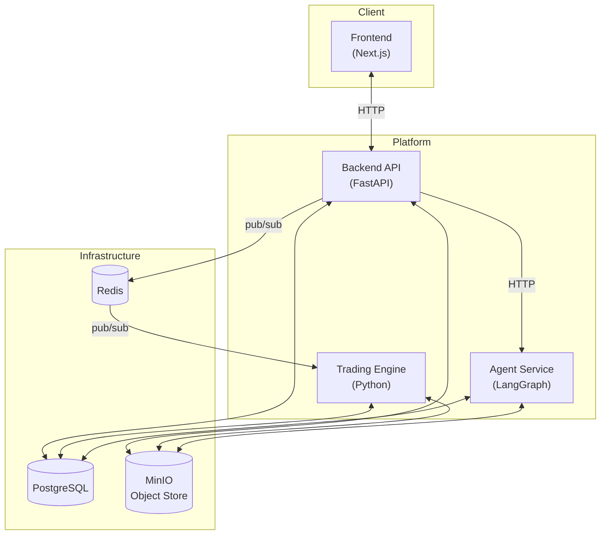
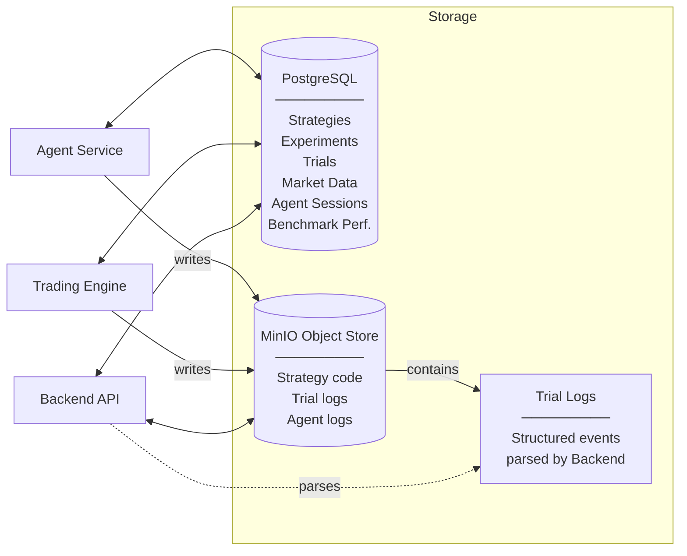
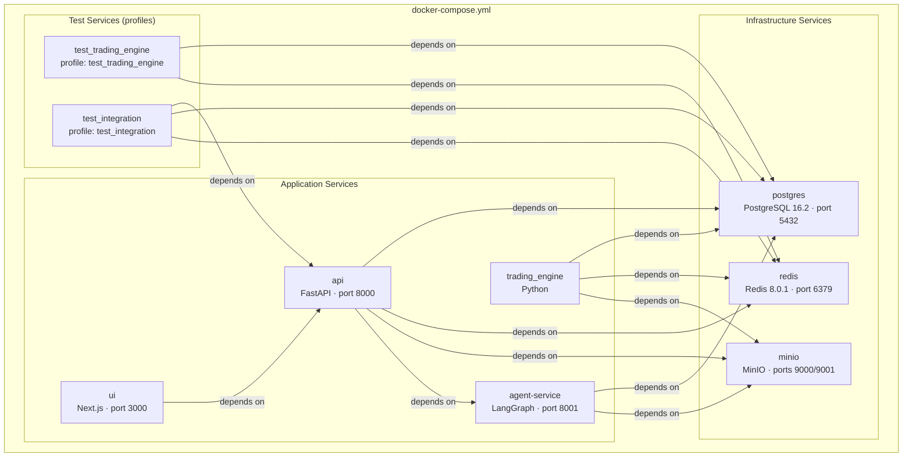
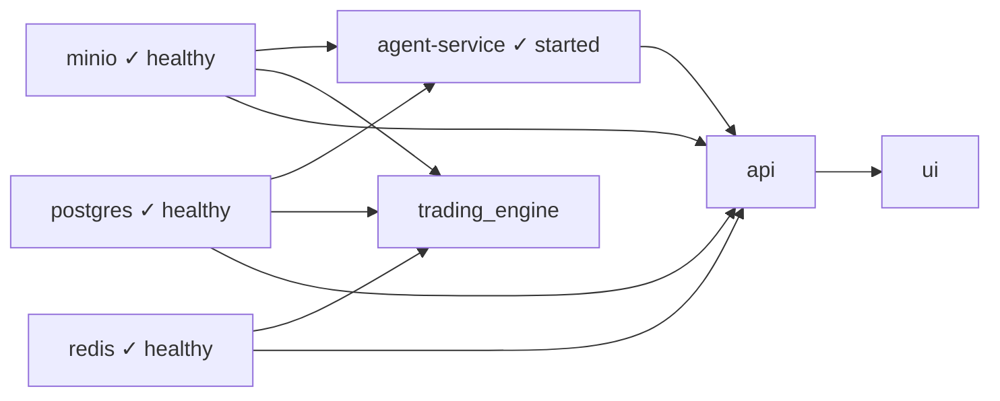

# Architecture Overview

**Axiomara** is a containerised platform for designing, backtesting, and analysing quantitative trading strategies. It combines a Python-based trading engine, a FastAPI backend, a Next.js frontend, and an LLM-powered agent service into a single Docker Compose stack. This document provides a high-level view of the system architecture: the major services, how they communicate, the storage layers that persist data and artefacts, the Docker Compose topology that ties everything together, and the testing infrastructure that keeps the codebase reliable. It is aimed at technical readers who need to navigate, extend, or operate the platform.

---

## 1. High-Level Software Architecture

The platform is made of four services that collaborate to run and manage trading strategy backtests.



### 1.1 Trading Engine

The trading engine is a Python service that processes backtesting commands. It subscribes to a Redis channel for incoming work (experiments, strategy insertions, market data downloads), executes strategy backtests across multiple trials, and persists results. It does not expose any HTTP API — it is driven entirely by Redis pub/sub messages published by the backend.

### 1.2 Backend API

The backend is a FastAPI application that serves as the central orchestration layer. It exposes REST endpoints consumed by the frontend and delegates long-running work (experiments, data downloads, strategy insertions) asynchronously to the trading engine via Redis. It also reads trial logs from object storage and parses them into structured events for the frontend.

### 1.3 Frontend

The frontend is a Next.js application. It provides the user interface for managing strategies, launching experiments, inspecting trial outcomes, viewing market data, and interacting with the agent. It communicates exclusively with the backend API — it never reaches the trading engine, agent, or infrastructure services directly.

### 1.4 Agent Service

The agent service is a LangGraph-based application that uses large language models to generate and refine trading strategy code. The backend API calls it over HTTP. The agent validates generated code, retries on failure, and stores session logs in object storage. It connects to PostgreSQL for session state and to MinIO for log persistence.

---

## 2. Storage Layers

Three storage systems support the platform. The diagram below shows which services interact with each store.



### 2.1 Database — PostgreSQL

PostgreSQL is the primary system of record. It stores relational metadata for:

| Table | Purpose |
|---|---|
| `strategies` | Strategy names, versions, and parameter metadata |
| `experiments` | Experiment definitions and state |
| `trials` | Individual trial records and outcomes |
| `agent_sessions` | Agent session state and history |
| `master_market_data` | Market data catalog (exchange, pair, timeframe) |
| `market_data.{id}` | Dynamic tables holding downloaded OHLCV data |
| `benchmark_performance.{id}` | Dynamic tables for experiment benchmark results |

All services that need durable state read and write through a shared data access layer (`shared/postgres/`).

### 2.2 Object Storage — MinIO

MinIO is an S3-compatible object store. It holds binary and text artifacts that do not fit well in a relational database:

| Directory | Content |
|---|---|
| `strategies/{name}/{version}/` | Strategy source code (`implementation.py`) |
| `trial_logs/trial_{id}.log` | Structured trial-level execution logs |
| `agent_logs/agent_{session_id}.log` | Agent session logs |

Both the backend and the trading engine access MinIO through shared utilities (`shared/minio/`), using a single bucket configured via environment variables.

### 2.3 Logs — Trial-Level Events

The trading engine emits structured logs during each trial. These logs are written to MinIO as text files. The backend later retrieves and parses them to reconstruct events, errors, and performance snapshots — without requiring tight coupling to the engine at runtime. This decoupled design allows the frontend to surface rich trial details (operations, metrics, tracebacks) by reading from the API alone.

---

## 3. Docker and Docker Compose

The entire platform is defined in a single `docker-compose.yml` at the repository root. Every service runs in a container, and all services share a Docker Compose network so they can reference each other by service name.

### 3.1 Service Map



### 3.2 Application Services

| Service | Dockerfile | Description |
|---|---|---|
| `api` | `api/Dockerfile` | FastAPI app served by Uvicorn on port 8000. Copies `shared/` into the image for database, storage, and logging utilities. |
| `agent-service` | `agent/Dockerfile` | LangGraph agent on port 8001. Receives HTTP calls from the API. Needs an `OPENAI_API_KEY` at runtime. |
| `ui` | `ui/Dockerfile` | Multi-stage Next.js build (deps → builder → runner). Runs as a non-root user on port 3000. Configured via `NEXT_PUBLIC_API_URL`. |
| `trading_engine` | `axiomara/Dockerfile` | Engine started via `entrypoint.sh`, which runs startup initialization then the main Redis listener loop. Copies `shared/` into the image. |

### 3.3 Infrastructure Services

| Service | Image | Volumes | Health Check |
|---|---|---|---|
| `postgres` | `postgres:16.2` | `postgres_data` (named volume) | `pg_isready -U postgres` |
| `redis` | `redis:8.0.1` | — | `redis-cli ping` |
| `minio` | `minio/minio` | `minio_data` (named volume) | `curl http://localhost:9000/minio/health/live` |

### 3.4 Startup Order and Health Checks

Services declare dependencies with health-check conditions to ensure a safe startup sequence:



Infrastructure services (PostgreSQL, Redis, MinIO) must pass their health checks before application services start. The frontend waits for the API, and the API waits for the agent service to be started.

### 3.5 Networking and Environment Variables

All services communicate over the default Compose network using service names as hostnames (e.g., `postgres`, `redis`, `minio`, `api`, `agent-service`). Environment variables are injected to configure:

- **Database connectivity**: `POSTGRES_USER`, `POSTGRES_PASSWORD`, `POSTGRES_DB`, `POSTGRES_HOST`, `POSTGRES_PORT`
- **Redis**: `REDIS_HOST`, `REDIS_PORT`
- **MinIO**: `MINIO_HOST`, `MINIO_PORT`, `MINIO_ROOT_USER`, `MINIO_ROOT_PASSWORD`
- **Object store layout**: `OBJECT_STORE_BUCKET_NAME`, `OBJECT_STORE_STRATEGIES_DIR`, `OBJECT_STORE_TRIAL_LOGS_DIR`, `OBJECT_STORE_AGENT_LOGS_DIR`
- **Inter-service URLs**: `NEXT_PUBLIC_API_URL`, `AGENT_SERVICE_URL`
- **API keys**: `OPENAI_API_KEY` (agent service)

### 3.6 Images and Build Context

Each service has its own `Dockerfile`, optimized for layer caching:

- **Backend and engine** use the repository root as build context so they can copy `shared/` alongside their own code.
- **Frontend** uses a multi-stage build: install dependencies → build the Next.js app → produce a minimal runner image as a non-root user.
- **Agent** copies selected trading engine modules it needs for code validation, keeping the image lightweight.

---

## 4. Testing

### 4.1 Unit Tests

Unit tests live in `tests/unit/` and cover the trading engine modules (orders, positions, portfolios, signals, risk management, rebalancing, performance, and more). They run inside a Docker container that has access to PostgreSQL and Redis.

To run unit tests locally:

```bash
docker compose --profile test_trading_engine up --build
```

### 4.2 Pre-Commit Hooks

The repository uses `pre-commit` hooks to enforce code quality on every commit:

- **Trailing whitespace** and **end-of-file** fixes
- **YAML validation**
- **Large file guard**
- **Black** — Python code formatting (line length 88, Python 3.12 target)
- **Ruff** — Fast Python linter with auto-fix
- **Unit test run** — Automatically triggers the trading engine test suite via Docker Compose

Install the hooks locally with:

```bash
pre-commit install
```

### 4.3 Integration Tests

Integration tests live in `tests/integration/` and exercise the full stack end-to-end — from the API through the trading engine and back. They spin up all required services (PostgreSQL, Redis, MinIO, the API, and the trading engine) and run parametrized scenarios across multiple strategies and market conditions.

---

## Appendix: Key Env Vars (selected)

For detailed setup instructions, configuration options, and scenario descriptions, refer to the dedicated **[Integration Tests README](../../tests/integration/README.md)**.
