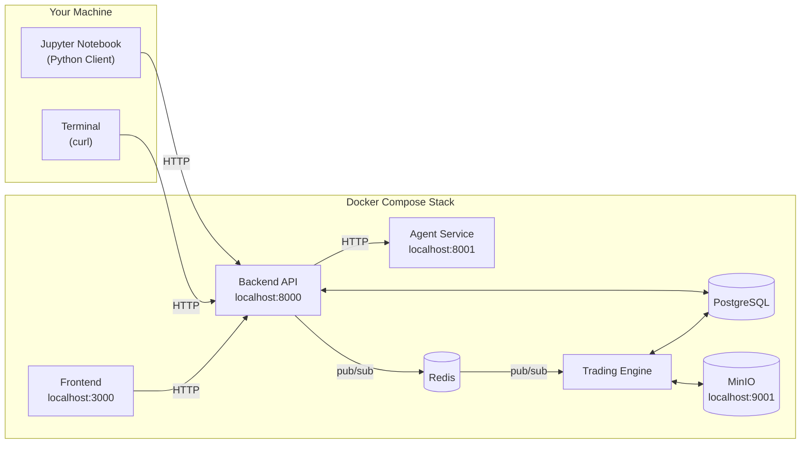
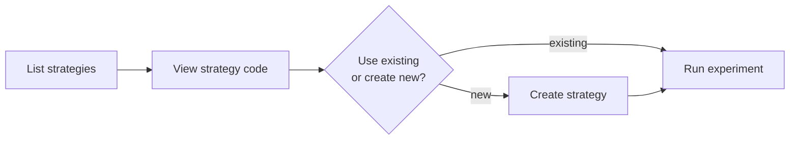
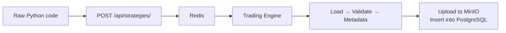
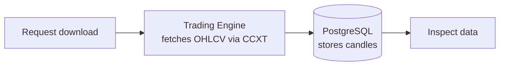
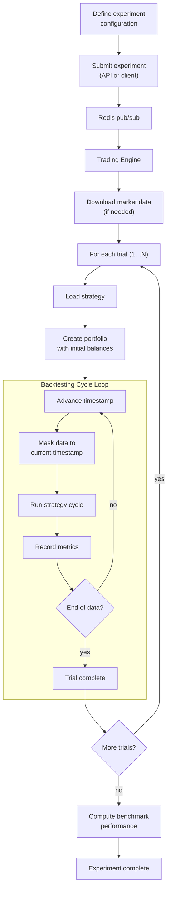
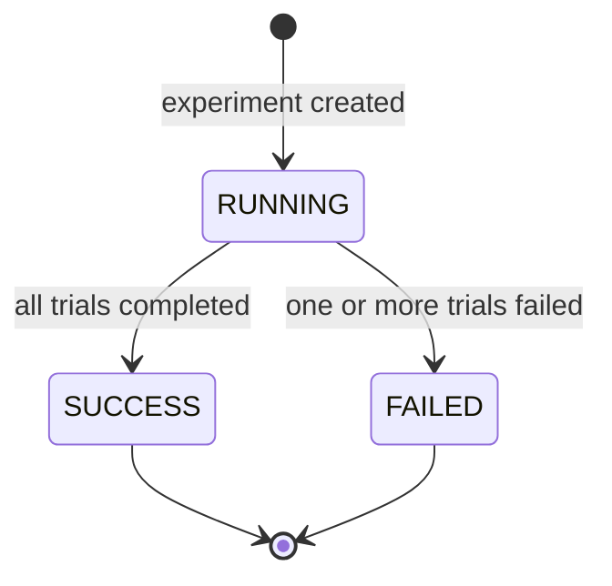
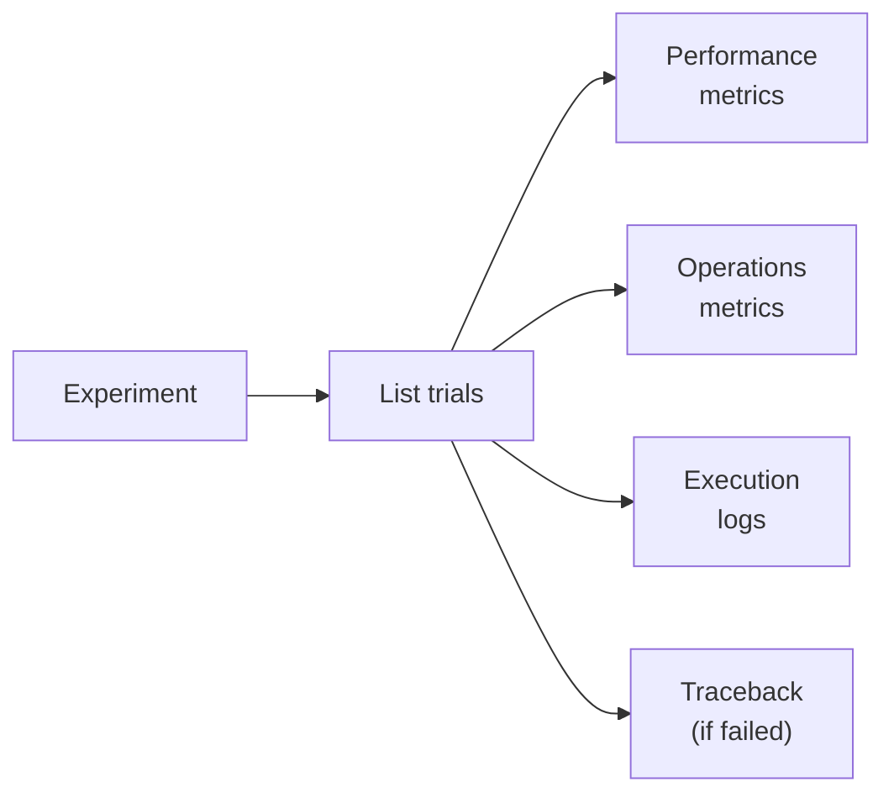
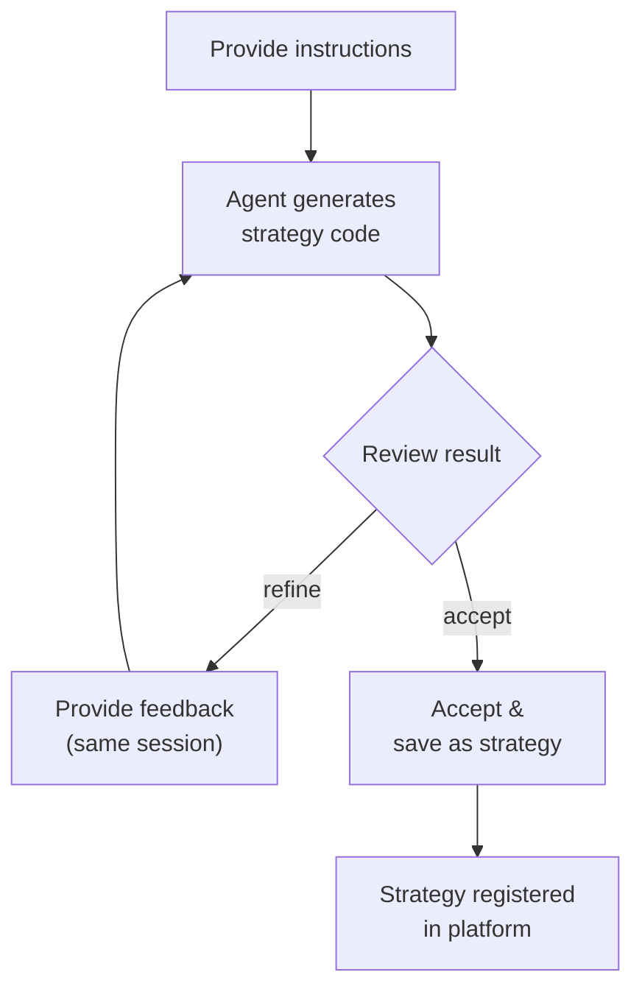

# Getting Started

This guide walks you through the Axiomara platform from first launch to inspecting backtest results. By the end, you will know how to manage strategies, download market data, run experiments, and analyse trial outcomes — using either the **Python client library** or the **REST API** directly.

Every example assumes the platform is running locally. Python snippets are written for a Jupyter notebook environment; REST API examples use `curl` from a terminal.

For deeper coverage of individual topics, see the dedicated documentation:

- [Architecture Overview](../architecture/overview.md)
- [Trading Engine Overview](../engine/overview.md)
- [Strategy Framework Overview](../strategy/overview.md)
- [Trading Module Overview](../trading/overview.md)

---

## Table of Contents

1. [Platform Setup](#1-platform-setup)
   - 1.1 [Prerequisites](#11-prerequisites)
   - 1.2 [Clone and Configure](#12-clone-and-configure)
   - 1.3 [Start the Platform](#13-start-the-platform)
   - 1.4 [Service Map](#14-service-map)
2. [Install the Python Client](#2-install-the-python-client)
   - 2.1 [Installation](#21-installation)
   - 2.2 [Create a Client Instance](#22-create-a-client-instance)
3. [Explore Available Strategies](#3-explore-available-strategies)
   - 3.1 [List Strategies](#31-list-strategies)
   - 3.2 [View Strategy Code](#32-view-strategy-code)
   - 3.3 [Create a New Strategy](#33-create-a-new-strategy)
4. [Download Market Data](#4-download-market-data)
   - 4.1 [Request a Download](#41-request-a-download)
   - 4.2 [List Market Data Objects](#42-list-market-data-objects)
   - 4.3 [Inspect OHLCV Data](#43-inspect-ohlcv-data)
5. [Run an Experiment](#5-run-an-experiment)
   - 5.1 [End-to-End Flow](#51-end-to-end-flow)
   - 5.2 [Create an Experiment](#52-create-an-experiment)
   - 5.3 [Monitor Experiments](#53-monitor-experiments)
   - 5.4 [Retrieve Benchmark Performance](#54-retrieve-benchmark-performance)
6. [Inspect Trial Results](#6-inspect-trial-results)
   - 6.1 [List Trials](#61-list-trials)
   - 6.2 [Performance Metrics](#62-performance-metrics)
   - 6.3 [Operations Metrics](#63-operations-metrics)
   - 6.4 [Trial Logs and Tracebacks](#64-trial-logs-and-tracebacks)
7. [Generate Strategies with the AI Agent](#7-generate-strategies-with-the-ai-agent)
   - 7.1 [Agent Workflow](#71-agent-workflow)
   - 7.2 [Run the Agent](#72-run-the-agent)
   - 7.3 [Accept a Generated Strategy](#73-accept-a-generated-strategy)
   - 7.4 [Inspect Agent Sessions](#74-inspect-agent-sessions)
8. [Stop the Platform](#8-stop-the-platform)
9. [Next Steps](#9-next-steps)

---

## 1. Platform Setup

### 1.1 Prerequisites

- [Docker](https://docs.docker.com/get-docker/) and [Docker Compose](https://docs.docker.com/compose/install/) (v2+)
- An **OpenAI API key** (required by the agent service)
- **Python 3.8+** (for the client library)

### 1.2 Clone and Configure

```bash
git clone https://github.com/<org>/axiomara.git
cd axiomara
```

Create a `.env` file at the repository root:

```dotenv
# PostgreSQL
POSTGRES_USER=postgres
POSTGRES_PASSWORD=postgres
POSTGRES_DB=axiomara

# MinIO
MINIO_ROOT_USER=minioadmin
MINIO_ROOT_PASSWORD=minioadmin

# OpenAI (required by the agent service)
OPENAI_API_KEY=sk-...
```

### 1.3 Start the Platform

```bash
docker compose up --build
```

Docker Compose health checks ensure that infrastructure services (PostgreSQL, Redis, MinIO) become healthy before application services start. On first launch, the trading engine automatically discovers and registers bundled example strategies.

### 1.4 Service Map

Once the platform is running, the following services are available:



| Service | URL |
|---|---|
| Frontend (UI) | [http://localhost:3000](http://localhost:3000) |
| Backend API | [http://localhost:8000](http://localhost:8000) |
| API Documentation (Swagger) | [http://localhost:8000/docs](http://localhost:8000/docs) |
| Agent Service | [http://localhost:8001](http://localhost:8001) |
| MinIO Console | [http://localhost:9001](http://localhost:9001) |

---

## 2. Install the Python Client

### 2.1 Installation

The Python client library lives in `client/python/`. Install it with pip:

```bash
pip install ./client/python
```

This installs the `axiomara_client` package along with its dependencies (`requests`, `pydantic`).

### 2.2 Create a Client Instance

#### Python

```python
from axiomara_client import Client

client = Client(base_url="http://localhost:8000")
```

The `base_url` defaults to `http://localhost:8000` and the request timeout defaults to 30 seconds. Both can be overridden:

```python
client = Client(base_url="http://localhost:8000", timeout=60)
```

#### curl

For the REST API, all endpoints live under `http://localhost:8000/api/`. No authentication is required.

```bash
# Verify the API is reachable
curl -s http://localhost:8000/api/experiments/ | python3 -m json.tool
```

---

## 3. Explore Available Strategies

The platform ships with several example strategies (e.g., momentum, mean reversion, simple trend). Strategies can also be added programmatically or generated by the AI agent.



### 3.1 List Strategies

#### Python

```python
strategies = client.strategies.list()

for s in strategies:
    print(f"{s.name} v{s.version} — {s.description}")
```

#### curl

```bash
curl -s http://localhost:8000/api/strategies/ | python3 -m json.tool
```

Each strategy object contains `name`, `version`, `description`, `parameters` (parameter schema with defaults), and a `default_experiment_config` that can serve as a starting point for experiments.

### 3.2 View Strategy Code

#### Python

```python
code = client.strategies.get("momentum_strategy", "1.0.0")

print(code.code)
```

#### curl

```bash
curl -s http://localhost:8000/api/strategies/momentum_strategy/1.0.0 | python3 -m json.tool
```

### 3.3 Create a New Strategy

Strategies are Python classes that extend `BaseStrategy`. The minimum requirements are:

1. A parameters class extending `BaseStrategyParameters`
2. A strategy class with a `generate_signals()` method, a `version`, and a `description`



#### Python

```python
from axiomara_client.models import StrategyConfig

raw_code = """
from typing import ClassVar, Type
from pydantic import Field, field_validator
from axiomara.strategy.strategy import BaseStrategy, BaseStrategyParameters
from axiomara.trading.enums import OrderSide, CandleFocus
from axiomara.trading.signal import Signal


class MyStrategyParameters(BaseStrategyParameters):
    lookback_periods: int = Field(default=20, description="Moving average lookback")

    @field_validator("lookback_periods")
    def check_lookback(cls, v):
        if v < 2:
            raise ValueError("lookback_periods must be at least 2")
        return v


class MyStrategy(BaseStrategy):
    parameters_model: ClassVar[Type[MyStrategyParameters]] = MyStrategyParameters
    version: str = "1.0.0"
    description: str = "A simple custom strategy"

    def generate_signals(self) -> None:
        for exchange, pair in self.data.get_exchange_pair_combinations():
            _, price = self.data.get_value_from_candle(
                exchange, pair, CandleFocus.CLOSE.value, index=-1
            )
            signal = Signal(
                pair=pair,
                side=OrderSide.BUY,
                qty=0.01,
                exchange=exchange,
                price=price,
                order_creation_ts=self.data.last_timestamp,
            )
            self.signals.append(signal)
"""

result = client.strategies.create(StrategyConfig(raw_code=raw_code))
print(result)
```

#### curl

```bash
curl -s -X POST http://localhost:8000/api/strategies/ \
  -H "Content-Type: application/json" \
  -d '{
    "raw_code": "from typing import ClassVar, Type\nfrom pydantic import Field, field_validator\nfrom axiomara.strategy.strategy import BaseStrategy, BaseStrategyParameters\nfrom axiomara.trading.enums import OrderSide, CandleFocus\nfrom axiomara.trading.signal import Signal\n\n\nclass MyStrategyParameters(BaseStrategyParameters):\n    lookback_periods: int = Field(default=20, description=\"Moving average lookback\")\n\n    @field_validator(\"lookback_periods\")\n    def check_lookback(cls, v):\n        if v < 2:\n            raise ValueError(\"lookback_periods must be at least 2\")\n        return v\n\n\nclass MyStrategy(BaseStrategy):\n    parameters_model: ClassVar[Type[MyStrategyParameters]] = MyStrategyParameters\n    version: str = \"1.0.0\"\n    description: str = \"A simple custom strategy\"\n\n    def generate_signals(self) -> None:\n        for exchange, pair in self.data.get_exchange_pair_combinations():\n            _, price = self.data.get_value_from_candle(\n                exchange, pair, CandleFocus.CLOSE.value, index=-1\n            )\n            signal = Signal(\n                pair=pair, side=OrderSide.BUY, qty=0.01,\n                exchange=exchange, price=price,\n                order_creation_ts=self.data.last_timestamp,\n            )\n            self.signals.append(signal)\n"
  }' | python3 -m json.tool
```

Strategy insertion is **asynchronous** — the API returns immediately with `{"status": "strategy_insertion_submitted"}` and the trading engine processes the insertion in the background. Re-list strategies after a few seconds to confirm it appeared.

> For the full strategy authoring reference, see the [Strategy Framework Overview](../strategy/overview.md).

---

## 4. Download Market Data

Before running an experiment you may want to pre-download market data. While experiments can download data automatically, creating market data objects explicitly lets you inspect the data first and reuse it across experiments.



### 4.1 Request a Download

#### Python

```python
from axiomara_client.models import CreateMarketDataObjectRequest

request = CreateMarketDataObjectRequest(
    exchange="binance",
    pair="BTC/USDT",
    since="2024-01-01T00:00:00Z",
    until="2024-03-01T00:00:00Z",
    candle_interval="1h",
)

result = client.market_data.create(request)
print(result)
```

#### curl

```bash
curl -s -X POST http://localhost:8000/api/market_data/ \
  -H "Content-Type: application/json" \
  -d '{
    "exchange": "binance",
    "pair": "BTC/USDT",
    "since": "2024-01-01T00:00:00Z",
    "until": "2024-03-01T00:00:00Z",
    "candle_interval": "1h"
  }' | python3 -m json.tool
```

The download is asynchronous. The trading engine connects to the exchange via CCXT, fetches OHLCV candles in batches, and stores them in PostgreSQL. If identical data already exists, it is reused automatically.

### 4.2 List Market Data Objects

#### Python

```python
market_data_objects = client.market_data.list()

for md in market_data_objects:
    print(f"{md.id} | {md.exchange} {md.pair} {md.candle_interval} | {md.status}")
```

#### curl

```bash
curl -s http://localhost:8000/api/market_data/ | python3 -m json.tool
```

Each object includes `id`, `exchange`, `pair`, `candle_interval`, `since`, `until`, `status`, and consistency metadata.

### 4.3 Inspect OHLCV Data

Once a download has completed with status `SUCCESS`, you can retrieve the raw candlestick data.

#### Python

```python
market_data_id = market_data_objects[0].id

candles = client.market_data.get(market_data_id)

for c in candles[:3]:
    print(f"{c.timestamp} | O:{c.open} H:{c.high} L:{c.low} C:{c.close} V:{c.volume}")
```

#### curl

```bash
curl -s http://localhost:8000/api/market_data/<market_data_object_id> | python3 -m json.tool
```

---

## 5. Run an Experiment

An experiment is the core unit of work on the platform. It combines a strategy with market data and runs one or more **trials**, each with a different set of parameters. After all trials complete, benchmark performance is computed for comparison.

### 5.1 End-to-End Flow



### 5.2 Create an Experiment

An experiment configuration specifies which strategy to use, the parameter values for each trial, the trading pairs, the date range, and the portfolio setup.

#### Python

```python
from axiomara_client import ExperimentConfig

config = ExperimentConfig(
    number_of_trials=2,
    strategy_name="momentum_strategy",
    strategy_version="1.0.0",
    strategy_parameters={
        "lookback_periods": [10, 20],
        "individual_take_profit": [0.2, 0.3],
        "individual_stop_loss": [-0.15, -0.2],
        "max_single_exposure": [0.2, 0.2],
        "max_open_orders": [10, 10],
        "initial_allocation_assets": [["BTC"], ["BTC"]],
        "initial_allocation_percentages": [[0.5], [0.5]],
        "rebalance_exchanges": [["binance"], ["binance"]],
        "rebalance_assets": [["USDT"], ["USDT"]],
        "rebalancing_strategy": ["UNIFORM", "UNIFORM"],
        "rebalancing_strategy_margin": [0.01, 0.01],
    },
    trading_eac=[["binance", "BTC/USDT"]],
    benchmark_eac=["binance", "BTC/USDT"],
    since="2024-01-01T00:00:00Z",
    until="2024-03-01T00:00:00Z",
    candle_interval="1h",
    portfolio_currency="USDT",
    initial_investment={"binance": 10000.0},
    backtesting_cycle_window=3600000,
    max_backtesting_cycles=1500,
)

result = client.experiments.create(config)
print(result)
```

#### curl

```bash
curl -s -X POST http://localhost:8000/api/experiments/ \
  -H "Content-Type: application/json" \
  -d '{
    "number_of_trials": 2,
    "strategy_name": "momentum_strategy",
    "strategy_version": "1.0.0",
    "strategy_parameters": {
      "lookback_periods": [10, 20],
      "individual_take_profit": [0.2, 0.3],
      "individual_stop_loss": [-0.15, -0.2],
      "max_single_exposure": [0.2, 0.2],
      "max_open_orders": [10, 10],
      "initial_allocation_assets": [["BTC"], ["BTC"]],
      "initial_allocation_percentages": [[0.5], [0.5]],
      "rebalance_exchanges": [["binance"], ["binance"]],
      "rebalance_assets": [["USDT"], ["USDT"]],
      "rebalancing_strategy": ["UNIFORM", "UNIFORM"],
      "rebalancing_strategy_margin": [0.01, 0.01]
    },
    "trading_eac": [["binance", "BTC/USDT"]],
    "benchmark_eac": ["binance", "BTC/USDT"],
    "since": "2024-01-01T00:00:00Z",
    "until": "2024-03-01T00:00:00Z",
    "candle_interval": "1h",
    "portfolio_currency": "USDT",
    "initial_investment": {"binance": 10000.0},
    "backtesting_cycle_window": 3600000,
    "max_backtesting_cycles": 1500
  }' | python3 -m json.tool
```

Key configuration fields:

| Field | Description |
|---|---|
| `number_of_trials` | How many trials to run. Each parameter list must have at least this many values. |
| `strategy_parameters` | Dictionary mapping each parameter name to a list of values — one per trial. |
| `trading_eac` | List of `[exchange, pair]` combinations the strategy is allowed to trade. |
| `benchmark_eac` | The `[exchange, pair]` used for benchmark comparison. |
| `backtesting_cycle_window` | Time step per cycle in milliseconds (e.g., `3600000` = 1 hour). |
| `max_backtesting_cycles` | Safety cap on the number of cycles per trial. |

### 5.3 Monitor Experiments

Experiment creation is asynchronous. Poll the experiments list to track progress.

#### Python

```python
experiments = client.experiments.list()

for exp in experiments:
    print(f"{exp.id} | {exp.strategy_name} v{exp.strategy_version} | {exp.status}")
```

#### curl

```bash
curl -s http://localhost:8000/api/experiments/ | python3 -m json.tool
```

An experiment transitions through the following statuses:



### 5.4 Retrieve Benchmark Performance

Once the experiment completes, you can retrieve the benchmark performance time series. This represents the hypothetical portfolio value if the initial investment had been placed entirely in the benchmark asset.

#### Python

```python
experiment_id = experiments[0].id

benchmark = client.experiments.get_benchmark_metrics(experiment_id)

for point in benchmark[:5]:
    print(f"{point.timestamp} | Value: {point.portfolio_value:.2f} | ROI: {point.roi:.4f}")
```

#### curl

```bash
curl -s http://localhost:8000/api/experiments/metrics/benchmark/<experiment_id> \
  | python3 -m json.tool
```

---

## 6. Inspect Trial Results

Each experiment produces one or more trials. Trials contain the detailed backtesting results: performance over time, trading operations, execution logs, and (on failure) tracebacks.



### 6.1 List Trials

#### Python

```python
experiment_id = experiments[0].id

trials = client.trials.list(experiment_id)

for t in trials:
    print(f"{t.id} | {t.status} | created: {t.created_at}")
```

#### curl

```bash
curl -s http://localhost:8000/api/trials/<experiment_id> | python3 -m json.tool
```

### 6.2 Performance Metrics

Performance metrics capture portfolio value, return on investment (ROI), and net profit at every backtesting cycle.

#### Python

```python
trial_id = trials[0].id

performance = client.trials.get_performance_metrics(trial_id)

for p in performance[:5]:
    print(f"{p.timestamp} | Value: {p.portfolio_value:.2f} | ROI: {p.roi:.4f} | Profit: {p.net_profit:.2f}")
```

#### curl

```bash
curl -s http://localhost:8000/api/trials/metrics/performance/<trial_id> \
  | python3 -m json.tool
```

### 6.3 Operations Metrics

Operations metrics track cumulative trading activity at each cycle: total filled orders, completed transfers, and fees paid.

#### Python

```python
operations = client.trials.get_operations_metrics(trial_id)

for o in operations[:5]:
    print(f"{o.timestamp} | Orders: {o.total_filled_orders} | Transfers: {o.total_completed_transfers} | Fees: {o.total_fees_paid:.4f}")
```

#### curl

```bash
curl -s http://localhost:8000/api/trials/metrics/operations/<trial_id> \
  | python3 -m json.tool
```

### 6.4 Trial Logs and Tracebacks

Execution logs contain structured events emitted by the strategy, trading manager, risk manager, and rebalancer during the trial.

#### Python

```python
logs = client.trials.get_logs(trial_id)
print(logs.logs[:2000])

traceback = client.trials.get_traceback(trial_id)
if traceback:
    print(traceback.traceback)
else:
    print("No traceback — trial completed successfully.")
```

#### curl

```bash
# Logs
curl -s http://localhost:8000/api/trials/logs/<trial_id> | python3 -m json.tool

# Traceback (returns null if no failure)
curl -s http://localhost:8000/api/trials/traceback/<trial_id> | python3 -m json.tool
```

---

## 7. Generate Strategies with the AI Agent

The platform includes an LLM-powered agent service that can generate and refine trading strategy code on demand. The agent runs iteratively: you provide instructions, it generates code, and you can refine or accept the result.

### 7.1 Agent Workflow



The agent supports two scenarios:

| Scenario | Description |
|---|---|
| `new_strategy` | Generate a brand-new strategy from scratch based on instructions. |
| `existing_strategy` | Refine an existing strategy, typically after inspecting trial results. |

### 7.2 Run the Agent

#### Python

```python
from axiomara_client.models import AgentRunRequest, LLMRunConfig

request = AgentRunRequest(
    scenario="new_strategy",
    user_instructions="Create a moving average crossover strategy that buys when a short MA crosses above a long MA and sells on the reverse.",
    investment_committee_instructions="Focus on risk management. Use conservative position sizing.",
    llm_config=LLMRunConfig(model="gpt-4o", temperature=0.2),
)

result = client.agent.run(request, timeout=300)

print(f"Session: {result.session_id}")
print(f"Run:     {result.run_number}")
print(f"Status:  {result.status}")
print(f"\nGenerated code:\n{result.code}")
```

#### curl

```bash
curl -s -X POST http://localhost:8000/api/agent/run \
  -H "Content-Type: application/json" \
  -d '{
    "scenario": "new_strategy",
    "user_instructions": "Create a moving average crossover strategy that buys when a short MA crosses above a long MA and sells on the reverse.",
    "investment_committee_instructions": "Focus on risk management. Use conservative position sizing.",
    "llm_config": {
      "model": "gpt-4o",
      "temperature": 0.2
    }
  }' | python3 -m json.tool
```

To refine the result in a follow-up iteration, pass the `session_id` from the previous run instead of `scenario`:

#### Python

```python
refinement = AgentRunRequest(
    session_id=result.session_id,
    user_instructions="Add RSI as a confirmation filter — only trade when RSI supports the signal direction.",
    llm_config=LLMRunConfig(model="gpt-4o", temperature=0.2),
)

refined = client.agent.run(refinement, timeout=300)
print(refined.code)
```

#### curl

```bash
curl -s -X POST http://localhost:8000/api/agent/run \
  -H "Content-Type: application/json" \
  -d '{
    "session_id": "<session_id>",
    "user_instructions": "Add RSI as a confirmation filter — only trade when RSI supports the signal direction.",
    "llm_config": {
      "model": "gpt-4o",
      "temperature": 0.2
    }
  }' | python3 -m json.tool
```

### 7.3 Accept a Generated Strategy

When you are satisfied with the generated code, accept it to register it as a strategy in the platform.

#### Python

```python
from axiomara_client.models import AgentAcceptRequest

accept_result = client.agent.accept(AgentAcceptRequest(session_id=result.session_id))
print(accept_result.status)
```

#### curl

```bash
curl -s -X POST http://localhost:8000/api/agent/accept \
  -H "Content-Type: application/json" \
  -d '{
    "session_id": "<session_id>"
  }' | python3 -m json.tool
```

Once accepted, the strategy appears in the strategies list and can be used in experiments.

### 7.4 Inspect Agent Sessions

#### Python

```python
sessions = client.agent.list_sessions()

for s in sessions:
    print(f"{s.id} | {s.scenario} | {s.status} | runs: {s.number_of_runs}")

metadata = client.agent.get_metadata(session_id=result.session_id)
print(f"Total LLM calls: {metadata.total_llm_calls}")
print(f"Total tokens:    {metadata.total_tokens}")

logs = client.agent.get_logs(session_id=result.session_id)
print(logs.logs[:2000])
```

#### curl

```bash
# List all sessions
curl -s http://localhost:8000/api/agent/sessions/ | python3 -m json.tool

# Session metadata
curl -s http://localhost:8000/api/agent/metadata/<session_id> | python3 -m json.tool

# Session logs
curl -s http://localhost:8000/api/agent/logs/<session_id> | python3 -m json.tool
```

---

## 8. Stop the Platform

```bash
docker compose down
```

To also remove persisted data (database volumes and object store):

```bash
docker compose down -v
```

---

## 9. Next Steps

Now that you have completed the getting started guide, explore these resources to deepen your understanding:

| Topic | Documentation |
|---|---|
| System design, services, and Docker topology | [Architecture Overview](../architecture/overview.md) |
| Engine internals, command dispatch, and component lifecycle | [Trading Engine Overview](../engine/overview.md) |
| Strategy authoring, hooks, signals, and the full API reference | [Strategy Framework Overview](../strategy/overview.md) |
| Portfolio management, order execution, risk guardrails, and rebalancing | [Trading Module Overview](../trading/overview.md) |
