# Trading Module Overview

The trading module is one of the three core modules that make up the DeepAlphaResearch trading engine, alongside the **strategy module** and the **components module**. While the strategy module defines *what* to trade and the components module provides shared infrastructure, the trading module handles *how* trading is executed: it manages orders and transfers, tracks portfolio state, enforces risk guardrails, and rebalances assets across exchanges. Users do not interact with this module directly — it is consumed by the trading engine and by strategies through well-defined interfaces.

This document covers the internal structure of the trading module, explains how its components relate to one another, and details the lifecycle of trading operations from signal creation through order execution.

---

## Table of Contents

1. [Module Architecture](#1-module-architecture)
   - 1.1 [Component Map](#11-component-map)
   - 1.2 [File Structure](#12-file-structure)
   - 1.3 [Component Groups](#13-component-groups)
2. [Trading Operations](#2-trading-operations)
   - 2.1 [TradingOperation Base Class](#21-tradingoperation-base-class)
   - 2.2 [Operation Lifecycle](#22-operation-lifecycle)
   - 2.3 [Order](#23-order)
   - 2.4 [Transfer](#24-transfer)
   - 2.5 [Trading Enums](#25-trading-enums)
3. [Operation Books](#3-operation-books)
   - 3.1 [OperationBook Structure](#31-operationbook-structure)
   - 3.2 [Operation Tracking Flow](#32-operation-tracking-flow)
4. [Signal](#4-signal)
   - 4.1 [Signal Structure](#41-signal-structure)
   - 4.2 [Signal-to-Order Conversion](#42-signal-to-order-conversion)
5. [Portfolio and Positions](#5-portfolio-and-positions)
   - 5.1 [Portfolio](#51-portfolio)
   - 5.2 [Position](#52-position)
   - 5.3 [Portfolio Accounting Flow](#53-portfolio-accounting-flow)
6. [Trading Manager](#6-trading-manager)
   - 6.1 [Responsibilities](#61-responsibilities)
   - 6.2 [Order Submission and Execution](#62-order-submission-and-execution)
   - 6.3 [Transfer Submission and Execution](#63-transfer-submission-and-execution)
   - 6.4 [Funding Checks](#64-funding-checks)
7. [Risk Manager](#7-risk-manager)
   - 7.1 [Guardrail Pipeline](#71-guardrail-pipeline)
   - 7.2 [PnL Guardrails](#72-pnl-guardrails)
   - 7.3 [Exposure Guardrails](#73-exposure-guardrails)
   - 7.4 [Open Orders Guardrails](#74-open-orders-guardrails)
   - 7.5 [Order Validation](#75-order-validation)
8. [Rebalancer](#8-rebalancer)
   - 8.1 [Rebalancing Strategies](#81-rebalancing-strategies)
   - 8.2 [Uniform Rebalancing Algorithm](#82-uniform-rebalancing-algorithm)
9. [End-to-End Flow](#9-end-to-end-flow)

---

## 1. Module Architecture

### 1.1 Component Map

The trading module is organized into four logical groups: **operations** (the fundamental units of trading), **books** (storage for operations), **portfolio management** (tracking of value and positions), and **orchestration** (coordination, risk, and rebalancing).

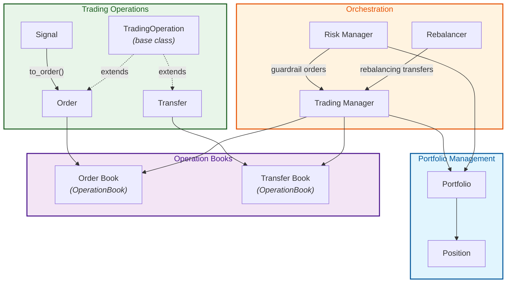

### 1.2 File Structure

```
deepalpharesearch/trading/
├── signal.py              # Signal class (strategy intent)
├── trading_manager.py     # TradingManager (central orchestrator)
├── trading_operation.py   # TradingOperation (abstract base)
├── order.py               # Order (concrete operation)
├── transfer.py            # Transfer (concrete operation)
├── operation_book.py      # OperationBook (status-based storage)
├── risk_manager.py        # RiskManager (guardrails & validation)
├── portfolio.py           # Portfolio (positions & balances)
├── position.py            # Position (per-asset tracking)
├── rebalancer.py          # Rebalancer (cross-exchange balancing)
├── enums.py               # All trading-related enumerations
├── fees.py                # Fee constants (trading, withdrawal, network)
├── utils.py               # Pair utilities (create_pair, split_pair)
├── exceptions.py          # TradingOperationError, BacktestingCycleStopSignal
└── performance.py         # BenchmarkPerformance, TrialPerformance
```

### 1.3 Component Groups

| Group | Components | Role |
|-------|-----------|------|
| **Operations** | `Signal`, `Order`, `Transfer`, `TradingOperation` | Represent trading intent and executable actions |
| **Books** | `OperationBook` (used as Order Book and Transfer Book) | Track operations through their lifecycle by status |
| **Portfolio Management** | `Portfolio`, `Position` | Maintain balances, positions, exposures, and PnL |
| **Orchestration** | `TradingManager`, `RiskManager`, `Rebalancer` | Coordinate submission, enforce risk limits, balance assets |

---

## 2. Trading Operations

### 2.1 TradingOperation Base Class

`TradingOperation` is the abstract base class for all executable trading actions. It provides a shared identity, lifecycle, and status-transition logic that `Order` and `Transfer` inherit.

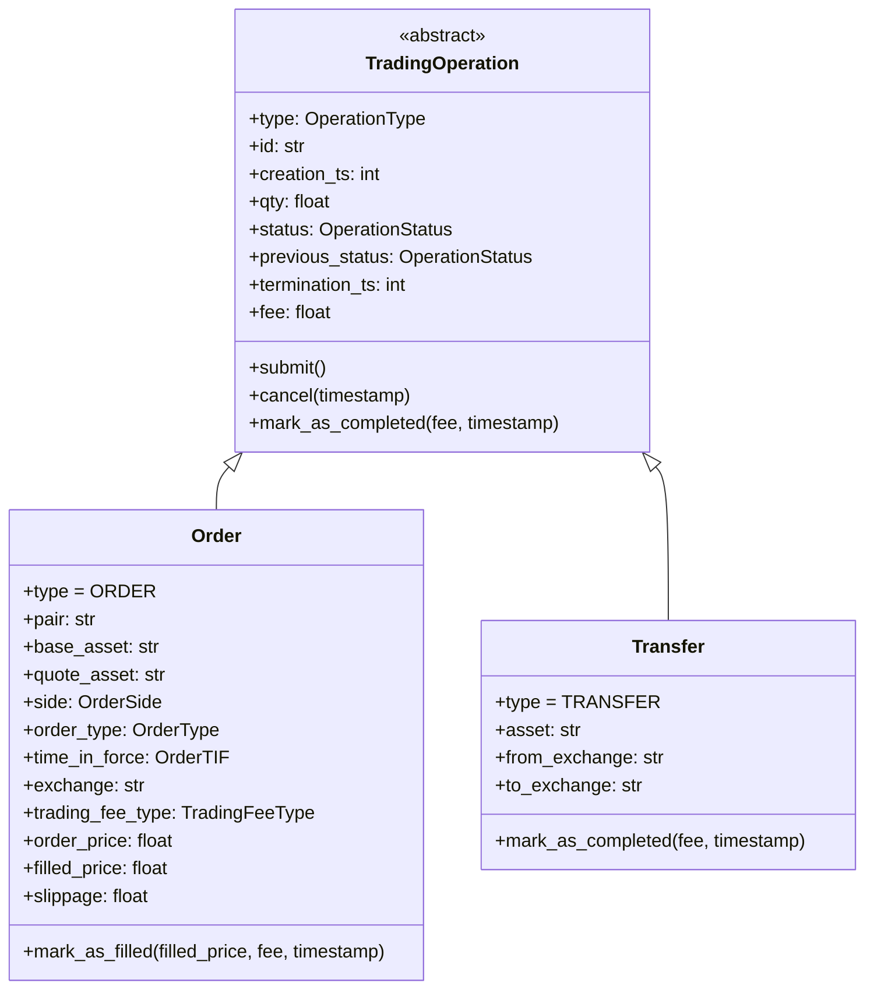

| Attribute | Type | Default | Description |
|-----------|------|---------|-------------|
| `id` | `str` | UUID4 hex | Unique 32-character identifier |
| `creation_ts` | `int` | Current time | Unix timestamp of creation |
| `qty` | `float` | *(required)* | Quantity of the asset |
| `status` | `OperationStatus` | `PENDING` | Current lifecycle state |
| `previous_status` | `OperationStatus` | `None` | State before the last transition |
| `termination_ts` | `int` | `None` | Timestamp when filled or canceled |
| `fee` | `float` | `None` | Fee charged upon completion |

### 2.2 Operation Lifecycle

Both orders and transfers follow the same state machine. Status transitions are enforced by `TradingOperation._change_status()`, which raises a `TradingOperationError` on invalid transitions.

```mermaid
stateDiagram-v2
    [*] --> PENDING : created
    PENDING --> SUBMITTED : submit()
    PENDING --> CANCELED : cancel()
    SUBMITTED --> FILLED : mark_as_completed()
    SUBMITTED --> CANCELED : cancel()
    FILLED --> [*]
    CANCELED --> [*]

    state PENDING {
        direction LR
    }
    state SUBMITTED {
        direction LR
    }
```

| Transition | Method | Constraint |
|------------|--------|------------|
| → `PENDING` | Constructor | Automatic on creation |
| `PENDING` → `SUBMITTED` | `submit()` | Must be `PENDING` |
| `PENDING` → `CANCELED` | `cancel(timestamp)` | Must be `PENDING` or `SUBMITTED` |
| `SUBMITTED` → `FILLED` | `mark_as_completed(fee, timestamp)` | Must be `SUBMITTED` |
| `SUBMITTED` → `CANCELED` | `cancel(timestamp)` | Must be `PENDING` or `SUBMITTED` |

### 2.3 Order

An `Order` represents a buy or sell instruction for a specific trading pair on an exchange. It extends `TradingOperation` with price, side, order type, and fee classification.

| Attribute | Type | Default | Description |
|-----------|------|---------|-------------|
| `pair` | `str` | *(required)* | Trading pair (e.g., `"BTC/USDT"`) |
| `base_asset` | `str` | Derived from `pair` | Base asset (e.g., `"BTC"`) |
| `quote_asset` | `str` | Derived from `pair` | Quote asset (e.g., `"USDT"`) |
| `side` | `OrderSide` | *(required)* | `BUY` or `SELL` |
| `order_type` | `OrderType` | `MARKET` | `MARKET` or `LIMIT` |
| `time_in_force` | `OrderTIF` | `GTC` | `GTC` or `day` |
| `exchange` | `str` | *(required)* | Target exchange |
| `trading_fee_type` | `TradingFeeType` | `TAKER` | `MAKER` or `TAKER` |
| `order_price` | `float` | From constructor | Intended execution price |
| `filled_price` | `float` | `None` | Actual fill price (set on fill) |
| `slippage` | `float` | `None` | Difference between filled and order price (limit orders) |

**Key behavior:** When an order is created with a `price` and its `order_type` is `MARKET`, the type is automatically promoted to `LIMIT`. Conversely, creating a `LIMIT` order without a price raises an error.

The `mark_as_filled(filled_price, fee, timestamp)` method records the fill price, computes slippage for limit orders, and delegates to `mark_as_completed()`.

### 2.4 Transfer

A `Transfer` represents the movement of an asset between two exchanges (e.g., for rebalancing).

| Attribute | Type | Default | Description |
|-----------|------|---------|-------------|
| `asset` | `str` | *(required)* | Asset being transferred (e.g., `"USDT"`) |
| `from_exchange` | `str` | *(required)* | Source exchange |
| `to_exchange` | `str` | *(required)* | Destination exchange |

Transfers follow the same lifecycle as orders. The `mark_as_completed()` method simply delegates to the base class implementation.

### 2.5 Trading Enums

All enumerations are defined in `deepalpharesearch/trading/enums.py`:

| Enum | Values | Purpose |
|------|--------|---------|
| `OperationStatus` | `PENDING`, `SUBMITTED`, `FILLED`, `CANCELED` | Lifecycle state of any operation |
| `OperationType` | `ORDER`, `TRANSFER` | Distinguishes operation kinds |
| `OrderSide` | `BUY`, `SELL` | Direction of a trade |
| `OrderType` | `MARKET`, `LIMIT` | Execution type |
| `OrderTIF` | `GTC`, `day` | Time in force policy |
| `TradingFeeType` | `MAKER`, `TAKER` | Fee classification |
| `RunningMode` | `BACKTESTING`, `LIVE` | Engine execution mode |
| `RebalancingStrategy` | `UNIFORM`, `NONE` | Rebalancing algorithm |
| `CandleFocus` | `OPEN`, `HIGH`, `LOW`, `CLOSE`, `VOLUME` | OHLCV candle element |

---

## 3. Operation Books

### 3.1 OperationBook Structure

The `OperationBook` class provides status-based storage for trading operations. The trading module uses two instances of the same class — one as the **order book** and one as the **transfer book** — inside the `TradingManager`.

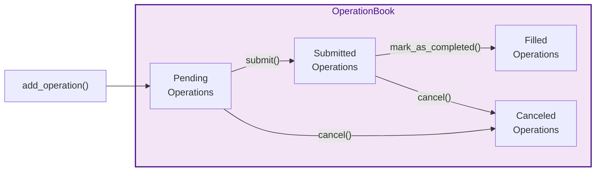

Internally, operations are stored in four dictionaries keyed by operation ID. The `update_operation()` method moves an operation from its `previous_status` bucket to its current `status` bucket whenever a state transition occurs.

| Method | Description |
|--------|-------------|
| `add_operation(operation)` | Adds an operation to the pending bucket |
| `update_operation(operation)` | Moves an operation between buckets after a status change |
| `change_trading_fee_type(id, fee_type)` | Updates the fee type of a submitted operation (orders only) |
| `pending_operations` | Property: list of all pending operations |
| `submitted_operations` | Property: list of all submitted operations |
| `filled_operations` | Property: list of all filled operations |
| `canceled_operations` | Property: list of all canceled operations |

### 3.2 Operation Tracking Flow

The following diagram shows how an order moves through the book as its status changes. Transfers follow the same pattern in the transfer book.

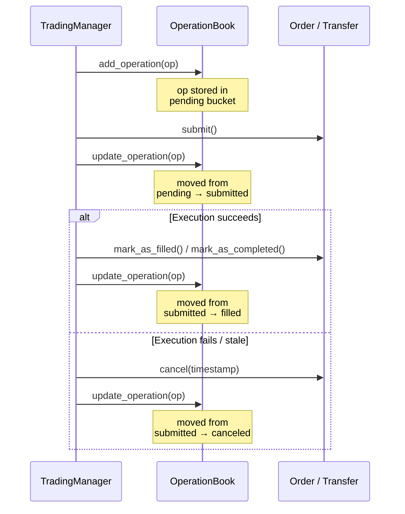

---

## 4. Signal

### 4.1 Signal Structure

A `Signal` is a lightweight object that captures a strategy's trading intent. Strategies produce signals; the framework converts them into orders. Signals are defined in `deepalpharesearch/trading/signal.py`.

| Attribute | Type | Required | Default | Description |
|-----------|------|----------|---------|-------------|
| `pair` | `str` | Yes | — | Trading pair (e.g., `"BTC/USDT"`) |
| `side` | `OrderSide` | Yes | — | `BUY` or `SELL` |
| `qty` | `float` | Yes | — | Quantity in base asset units |
| `exchange` | `str` | Yes | — | Target exchange |
| `price` | `float` | No | `None` | Limit price; `None` implies a market order |
| `order_creation_ts` | `int` | No | `None` | Creation timestamp; defaults to current time if omitted |
| `order_time_in_force` | `OrderTIF` | No | `GTC` | Time in force policy |
| `order_type` | `OrderType` | No | `MARKET` | Order type |

### 4.2 Signal-to-Order Conversion

The `to_order()` method on `Signal` performs a direct, one-to-one mapping from signal attributes to `Order` constructor parameters:

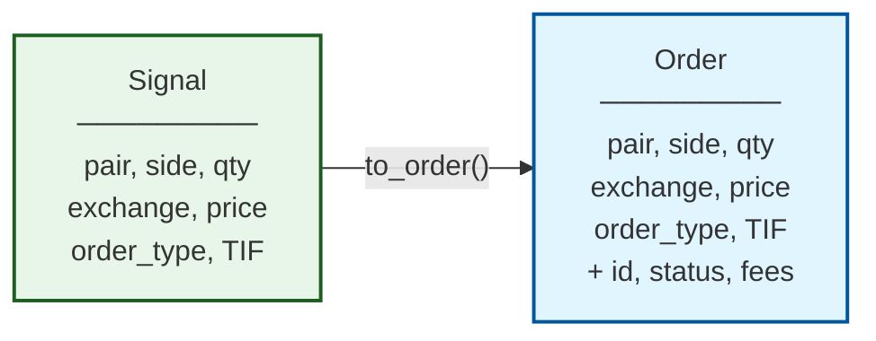

The conversion is mechanical — no transformation, filtering, or validation happens at this stage. Validation is deferred to the `RiskManager.validate_orders()` step that follows.

---

## 5. Portfolio and Positions

### 5.1 Portfolio

The `Portfolio` class maintains the complete financial state of a strategy: base-currency balances per exchange and open/closed positions for every traded asset. It is defined in `deepalpharesearch/trading/portfolio.py`.

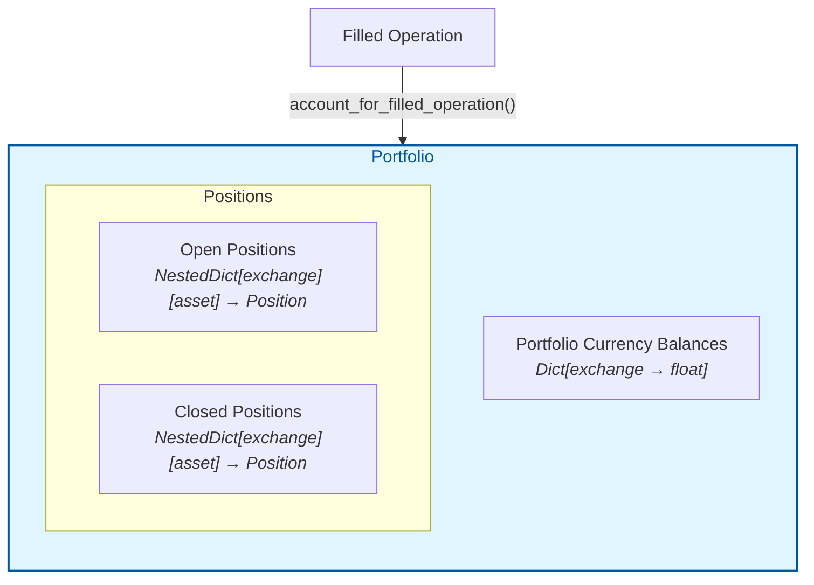

| Method | Signature | Description |
|--------|-----------|-------------|
| `account_for_filled_operation` | `(operation) → None` | Updates balances and positions after a filled order or transfer |
| `get_balance` | `(asset, exchange?) → float` | Returns the balance for an asset, optionally scoped to an exchange |
| `get_all_balances` | `() → Dict[str, float]` | Aggregated balances per asset across all exchanges |
| `get_total_value` | `(market_prices) → float` | Sum of all position values plus portfolio currency balances |
| `get_exposures` | `(market_prices, total_value) → Dict[str, float]` | Per-asset exposure as a fraction of total portfolio value |
| `open_positions` | Property | List of all open `Position` objects |
| `closed_positions` | Property | List of all closed `Position` objects |
| `positions` | Property | Combined list of open and closed positions |

**Accounting rules for filled operations:**

| Operation Type | Side | Balance Effect | Position Effect |
|---------------|------|----------------|-----------------|
| Order | BUY | Quote balance decreases by `qty × price + fee` | Position qty increases; average price recalculated |
| Order | SELL | Quote balance increases by `qty × price − fee` | Position qty decreases; realized PnL recorded |
| Transfer | — | Source exchange balance decreases by `qty + fee`; destination increases by `qty` | No position change |

### 5.2 Position

A `Position` tracks the quantity, average entry price, and profit/loss for a single asset on a single exchange. Defined in `deepalpharesearch/trading/position.py`.

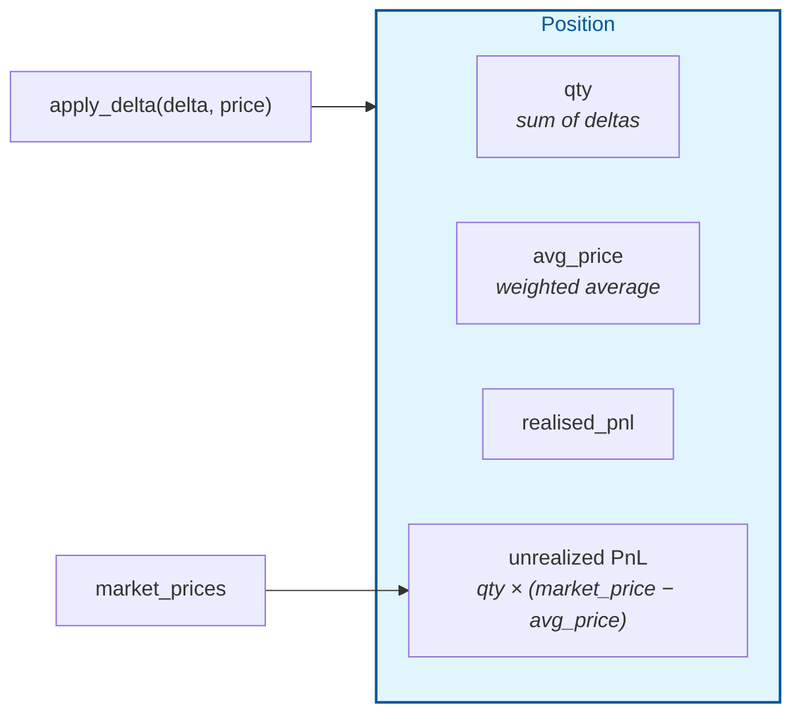

| Attribute / Method | Type | Description |
|--------------------|------|-------------|
| `id` | `str` | Unique identifier |
| `exchange` | `str` | Exchange this position belongs to |
| `pair` | `str` | Trading pair |
| `base_asset` / `quote_asset` | `str` | Derived from `pair` |
| `qty` (property) | `float` | Current quantity (sum of all deltas) |
| `avg_price` (property) | `float` | Current volume-weighted average entry price |
| `value` (property) | `float` | `qty × avg_price` |
| `is_closed` (property) | `bool` | `True` when `qty < 1e-8` |
| `realised_pnl` | `float` | Cumulative realized profit/loss |
| `apply_delta(delta, price)` | Method | Adjusts position; updates avg price on increase, records realized PnL on decrease |
| `get_unrealized_pnl(market_prices)` | Method | Returns `qty × (market_price − avg_price)` |

**Average price calculation on position increase:**

```
new_avg_price = (avg_price × qty + price × delta) / (qty + delta)
```

**Realized PnL calculation on position decrease:**

```
realised_pnl -= delta × (price − avg_price)
```

(where `delta` is negative for sells, making `realised_pnl` increase when selling above average price)

### 5.3 Portfolio Accounting Flow

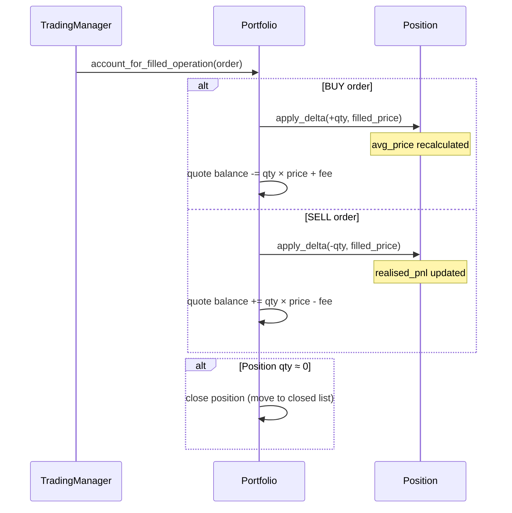

---

## 6. Trading Manager

### 6.1 Responsibilities

The `TradingManager` is the central orchestrator of the trading module. It owns the order book and transfer book, manages submission and execution, performs funding checks, and updates the portfolio after fills. Defined in `deepalpharesearch/trading/trading_manager.py`.

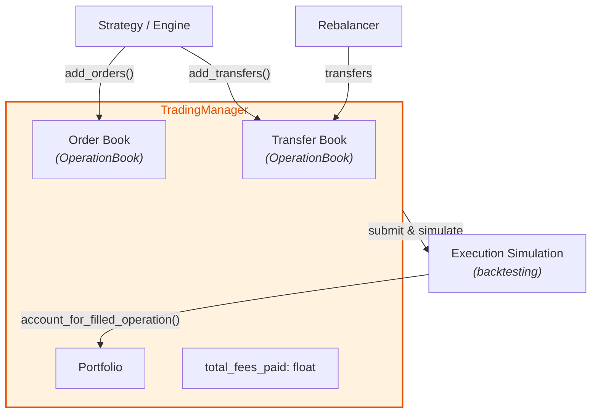

| Method | Description |
|--------|-------------|
| `add_orders(orders)` | Adds a list of orders to the order book |
| `add_transfers(transfers)` | Adds a list of transfers to the transfer book |
| `cancel_orders(orders, timestamp)` | Cancels the given orders and updates the order book |
| `submit_all_pending_orders(data?)` | Submits all pending orders; simulates execution in backtesting mode |
| `submit_all_pending_transfers(running_mode, timestamp)` | Submits all pending transfers; simulates execution in backtesting mode |
| `total_filled_orders` (property) | Count of filled orders in the order book |
| `total_completed_transfers` (property) | Count of filled transfers in the transfer book |

### 6.2 Order Submission and Execution

```mermaid
flowchart TD
    A["submit_all_pending_orders(data)"] --> B["For each pending order:<br/>status → SUBMITTED"]
    B --> C{Running in<br/>backtesting?}
    C -- Yes --> D["_simulate_orders_execution(data)"]
    C -- No --> E["Orders remain<br/>SUBMITTED<br/>(awaiting external fill)"]

    D --> F["For each submitted order"]
    F --> G["Get simulated price<br/>from market data"]
    G --> H{Price available?<br/><i>(limit in range?)</i>}
    H -- No --> I["Change fee type<br/>to MAKER, skip"]
    H -- Yes --> J{Sufficient<br/>funding?}
    J -- No --> K["Cancel order"]
    J -- Yes --> L["Fill order<br/>Update portfolio<br/>Add fee"]

    style A fill:#fff3e0,stroke:#e65100
    style L fill:#e8f5e9,stroke:#1b5e20
    style K fill:#ffcdd2,stroke:#b71c1c
```

**Simulated execution price logic:**

| Order Type | Fill Condition | Simulated Price |
|------------|---------------|-----------------|
| `MARKET` | Always fills | Latest close price from market data |
| `LIMIT BUY` | Close price ≤ limit price | Latest close price |
| `LIMIT SELL` | Close price ≥ limit price | Latest close price |
| `LIMIT` (out of range) | Does not fill | `None` — order remains submitted |

### 6.3 Transfer Submission and Execution

Transfer submission follows the same pattern. In backtesting mode, each transfer is checked for sufficient funding on the source exchange. If funded, the transfer is marked as completed and the portfolio is updated. Otherwise, the transfer is canceled.

### 6.4 Funding Checks

The `_has_sufficient_funding()` method validates that the portfolio has enough balance to execute an operation:

| Operation | Side | Check |
|-----------|------|-------|
| Order | BUY | Quote asset balance ≥ `qty × price + fee` |
| Order | SELL | Base asset balance ≥ `qty` |
| Transfer | — | Asset balance on `from_exchange` ≥ `qty + fee` |

---

## 7. Risk Manager

### 7.1 Guardrail Pipeline

The `RiskManager` enforces pre-trade and post-trade risk limits. It runs **before** the strategy's signal generation logic in each cycle, ensuring that risk boundaries are respected proactively. Defined in `deepalpharesearch/trading/risk_manager.py`.

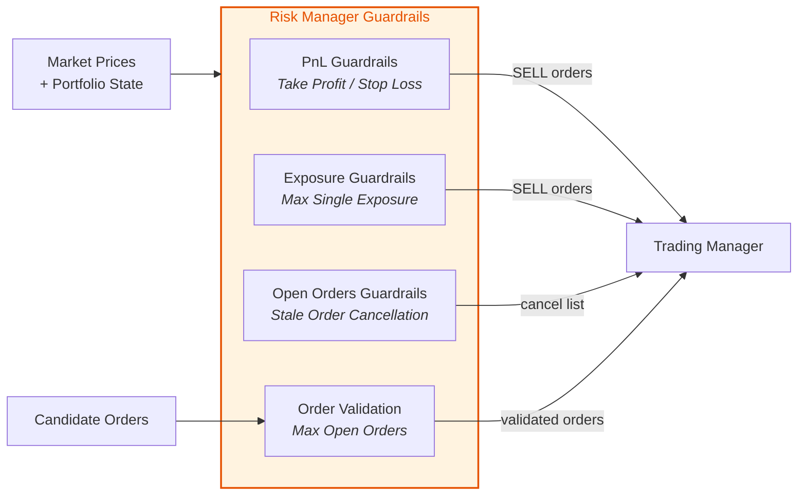

| Method | Input | Output | Description |
|--------|-------|--------|-------------|
| `update_pnl(portfolio)` | Portfolio state | List of SELL orders | Generates take-profit / stop-loss orders |
| `update_exposures(portfolio)` | Portfolio state | List of SELL orders | Generates exposure-reduction orders |
| `update_open_orders(open_orders)` | List of open orders | List of orders to cancel | Identifies stale orders past max age |
| `validate_orders(candidates)` | Candidate order list | Filtered order list | Enforces `max_open_orders` limit |

### 7.2 PnL Guardrails

For each open position, the risk manager computes the unrealized PnL as a percentage of position value. If a threshold is breached, a market SELL order is generated for the full position quantity.

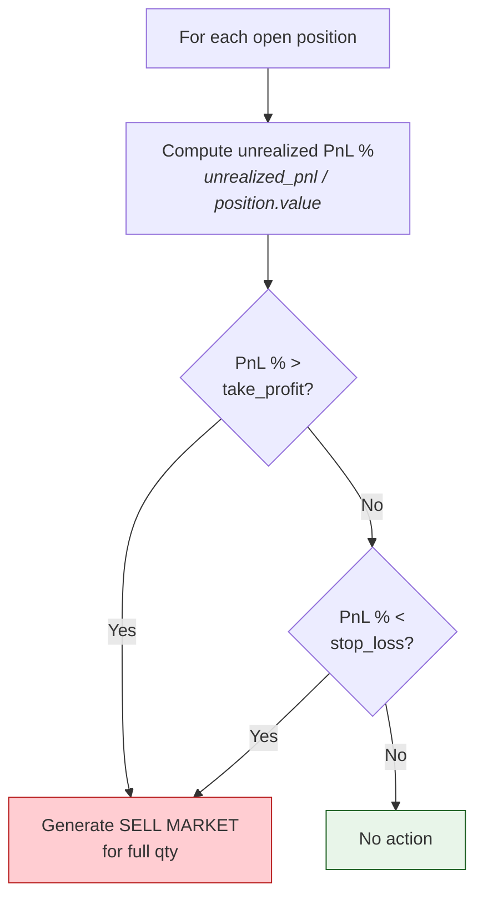

| Parameter | Type | Default | Description |
|-----------|------|---------|-------------|
| `individual_take_profit` | `float` | `0.2` | Triggers SELL when unrealized PnL % exceeds this value (e.g., 20%) |
| `individual_stop_loss` | `float` | `-0.2` | Triggers SELL when unrealized PnL % falls below this value (e.g., -20%) |

### 7.3 Exposure Guardrails

The exposure guardrail prevents over-concentration in a single asset. When an asset's exposure (value / total portfolio value) exceeds the limit, SELL orders are generated to reduce the position.

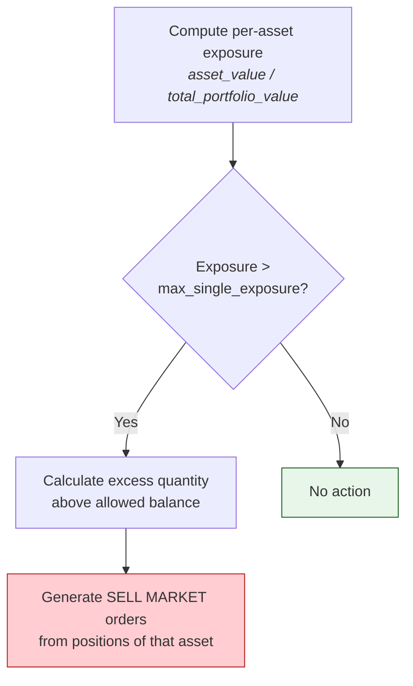

| Parameter | Type | Default | Description |
|-----------|------|---------|-------------|
| `max_single_exposure` | `float` | `0.2` | Maximum fraction of portfolio in a single asset (e.g., 20%) |

### 7.4 Open Orders Guardrails

Outstanding orders that have exceeded the maximum age threshold are collected for cancellation. This prevents stale limit orders from accumulating indefinitely.

### 7.5 Order Validation

When `max_open_orders` is set, the `validate_orders()` method trims candidate orders to stay within the limit. Orders are prioritized by creation timestamp (most recent first).

| Parameter | Type | Default | Description |
|-----------|------|---------|-------------|
| `max_open_orders` | `int` | `10` | Maximum number of concurrent open orders allowed |

---

## 8. Rebalancer

### 8.1 Rebalancing Strategies

The `Rebalancer` generates inter-exchange transfers to maintain a desired distribution of base-currency assets across exchanges. It is defined in `deepalpharesearch/trading/rebalancer.py`.

| Strategy | Enum Value | Behavior |
|----------|------------|----------|
| **Uniform** | `RebalancingStrategy.UNIFORM` | Distributes each rebalance asset equally across all configured exchanges |
| **None** | `RebalancingStrategy.NONE` | Disables automatic rebalancing |

| Configuration | Type | Default | Description |
|--------------|------|---------|-------------|
| `rebalance_exchanges` | `list[str]` | `["binance"]` | Exchanges included in rebalancing (activates only with > 1 exchange) |
| `rebalance_assets` | `list[str]` | `["USDT"]` | Assets to rebalance |
| `rebalancing_strategy` | `RebalancingStrategy` | `UNIFORM` | Algorithm to use |
| `rebalancing_strategy_margin` | `float` | `0.01` | Minimum deviation ratio before a transfer is generated |

### 8.2 Uniform Rebalancing Algorithm

The uniform strategy iteratively transfers assets from the exchange with the largest surplus to the exchange with the largest deficit until all deviations fall below the configured margin.

```mermaid
flowchart TD
    A["For each rebalance asset"] --> B["total = sum of balances<br/>across exchanges"]
    B --> C["target = total / num_exchanges"]
    C --> D["Compute delta per exchange<br/><i>(balance − target) / target</i>"]
    D --> E{All same sign?}
    E -- Yes --> F["Skip<br/><i>(already balanced)</i>"]
    E -- No --> G{max |delta| ≥<br/>margin?}
    G -- No --> H["Done"]
    G -- Yes --> I["Transfer from<br/>max surplus exchange<br/>to max deficit exchange"]
    I --> J["Amount = min(surplus, |deficit|)<br/>× target"]
    J --> K["Create Transfer object"]
    K --> D

    style H fill:#e8f5e9,stroke:#1b5e20
    style F fill:#e8f5e9,stroke:#1b5e20
    style K fill:#e1f5fe,stroke:#01579b
```

---

## 9. End-to-End Flow

The following diagram traces the complete path from signal generation through portfolio update, showing how all trading module components collaborate within a single strategy cycle.

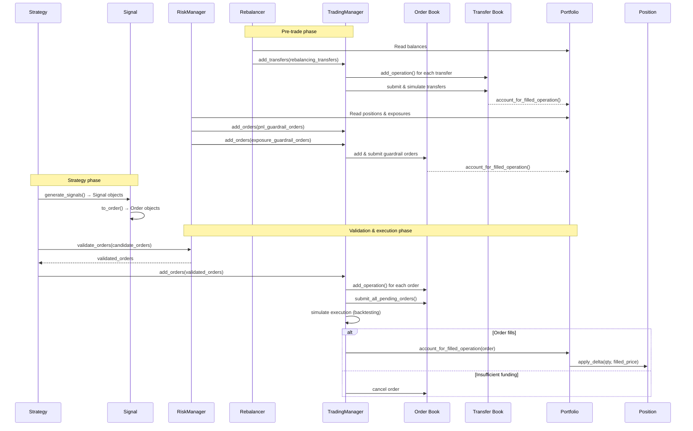
